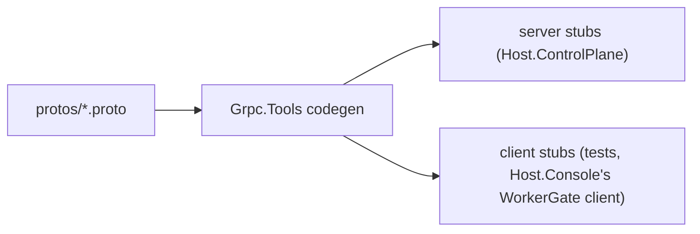

## How it works

```mermaid
flowchart LR
    p["protos/*.proto"] --> gen["Grpc.Tools codegen"]
    gen --> srv["server stubs (Host.ControlPlane)"]
    gen --> cli["client stubs (tests, Host.Console's WorkerGate client)"]
```
