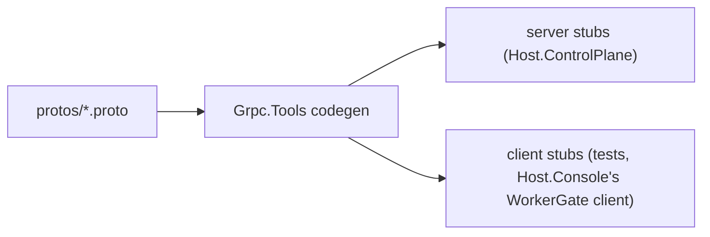

# ControlPlane.Contracts

> The wire format: four services for the desktop, one for the worker, no logic.

## To change here, read

- [[pages/invariants/no-executive-writes]]
- [[pages/decisions/0032-per-feature-write-permissions]]
- [[pages/decisions/0033-channel-operator-architecture]]
- [[pages/services/host-control-plane]]
- [[pages/services/control-plane]]
- [[pages/conventions/testing]]

## Responsibility

Holds `.proto` files and generates C# for both sides (`GrpcServices="Both"`). The project contains no hand-written `.cs` files.

## Public contract

All five services share package `scout.controlplane.v1` and C# namespace `Scout.ControlPlane.Contracts`. The proto files carry no comments; what a field means is written here.

- **Providers** (`src/Scout.ControlPlane.Contracts/protos/providers.proto:8`): `ListProviders`, `GetProviderStatus`, `StartProvider`, `StopProvider`, `RestartProvider`, `SetAutostart`, `WatchProviderStatus` (server stream).
- **Models** (`src/Scout.ControlPlane.Contracts/protos/models.proto:11`): `PullModel` (server stream of progress), `DeleteModel`, `ListModels`.
- **Features** (`src/Scout.ControlPlane.Contracts/protos/features.proto:8`): `ListFeatures`, `SetCredentials`, `Setup`, `DeleteCredentials`, `Enable`, `Disable`, `SetWriteGrant`, `ListPendingActions`, `ApproveAction`, `RejectAction`, `ListWrites` ([[pages/decisions/0032-per-feature-write-permissions]]).
  - `FeatureScopeRow.access` (`:55`): 0 read, 1 write, 2 irreversible write. `Feature` (`:59`) carries `write_class` (`:75`; 0 none, 1 descriptive, 2 executive), `granted` and the optional ISO 8601 round-trip time of the owner's grant, `granted_at` (`:77`). Every addition is a new field number, so a client built on the earlier proto still reads the message.
  - `EnableRequest.confirm_writes` (`:106`): the owner confirmed the write rows; enabling a feature with write rows without it answers `FAILED_PRECONDITION`. `SetWriteGrantRequest` (`:113`, `id`, `granted`, `confirm_writes`) grants or revokes the write permission of a feature with write rows; granting needs `confirm_writes`, revoking does not.
  - `PendingAction` (`:119`): an irreversible action waiting for the owner, times in ISO 8601, `status` one of `pending`, `approved`, `rejected`, `executed` (approved and recorded by the worker), `executing` (approved and claimed by a worker that has not recorded it yet, listed by `ListPendingActions` and refused by `ApproveAction` and `RejectAction` as already decided), and the owner's optional `reason` on either decision; `ApproveAction` and `RejectAction` take `ActionDecisionRequest` (`:137`, `id`, optional `reason`) and return the decided action with that reason.
  - `WriteLogEntry` (`:141`): one write a feature performed, `approved_by` `owner` or unset; `ListWritesRequest.limit` (`:152`) is the number of newest entries to return, 0 or less means 50.
- **Operator** (`src/Scout.ControlPlane.Contracts/protos/operator.proto:7`): the desktop's door to the channel operator's state ([[pages/decisions/0033-channel-operator-architecture]]): `GetMandate`, `SaveMandate`, `ListProjects`, `GetProject`, `StartProject`, `DecideClaim`, `ProduceProject`, `DelegateProject` (`:15`), `ReorderScenes`, `SetSceneLocked`, `RegenerateScene`, `AttachSceneMedia`, `GetMediaDirectory`, `DeleteProject` (`:21`, takes `GetProjectRequest`, answers the empty `DeleteProjectResponse`, `:63`), `GetReadiness`, `AssembleProject`, `ConfirmMediaRights`, `EditPackageMetadata`, `ApprovePackage`, `PublishPackage`, `DecideProposal`, `StartExperiment`, `AdoptExperimentWinner` (`:8` to `:30`), and the comments' `ListComments`, `RequestCommentSync`, `DecideComment`, `ApproveReply`, `DecideIdea` (`:31` to `:35`), and `GetVoiceSamplesDirectory` (`:36`).
  - `Mandate` (`:41`): `objective`, `audience`, `pillars` (at most 5, each at most 80 characters), `cadence`, `language`, `voice_and_style`, `blocked_topics`, `target_metric`, `target_value`, the optional ISO 8601 round-trip `updated_at`, set by the control plane when it saves; field 11, the `narration_voice` the mandate carried until the owner moved the voice to the video on 2026-11-03, is `reserved 11;` (`:52`), so no later field reuses its number (`tests/Scout.ControlPlane.Tests/Integration/OperatorGrpcTests.cs:590`). `SaveMandate` takes and returns it; `objective` and `language` are required.
  - `ListProjectsRequest.limit` (`src/Scout.ControlPlane.Contracts/protos/operator.proto:55`): 0 or less means 50, at most 200; newest first. `StartProjectRequest.topic` (`:83`): 3 to 200 characters after trimming; without the owner's YouTube write grant `StartProject` answers `PERMISSION_DENIED` with the write gate's reason.
  - `DecideClaimRequest` (`:87`): `project_id`, `claim_id`, `status` one of `supported`, `unsupported`, `waived`, and the optional `note`, required for `waived`.
  - `Project` (`:94`): `id`, `topic`, `status` (`queued`, `researching`, `scripting`, `script_ready`, `production_queued`, `producing`, `media_ready`, `assembly_queued`, `assembling`, `assembled`, `approved`, `failed`), `origin` (`desktop` or `chat`), ISO 8601 `created_at` and `updated_at`, `candidates` (`TopicCandidate`, `:115`: `title`, `reason`, `fit`), the optional `script` (`Script`, `:121`: `hook`, `sections` of `ScriptSection` `:131` `heading` and `narration`, `call_to_action`, `title_variants`, `description`, `tags`, `chapters` of `Chapter` `:136` `at` and `title`), `claims`, the optional `error`, `scenes`, the optional `package` (`:106`), unset until the owner first asks for assembly, the optional `publication` (`:107`), unset until the owner publishes, the optional `background_file` (`:108`), the owner's picture in the project's media directory that every scene without a picture of its own is rendered over, under the visual file name rule, unset until the owner attaches one; the worker cannot set or clear it, a save keeps the stored one, `delegated` (`:109`), true once the owner delegated the project, `narration_voice` (`:110`), the id of the voice the owner chose when producing the project, one the readiness offered, empty for Scout's choice, `visual_brief` (`:111`), the visual style the owner asked for when producing or delegating the project, at most 500 characters, empty for none, which the worker's scene planner writes the picture prompts and search terms in, and `motion` (`:112`), the motion preset the video is assembled with, `still`, `gentle` or `dynamic`, `gentle` until the owner chooses; the worker sends the last three back as read, and the control plane keeps the stored values whatever it sends. A `Project` never carries the conversation reference a chat request came from.
  - `Claim` (`:141`): `id`, `text`, `risk`, `source_urls`, `status` (`pending` or `unsupported` from the worker; `supported`, `unsupported` or `waived` from the owner) and the optional `note`.
  - `Scene` (`:150`): `id`, `order` (the owner's order starts at 1), `narration`, `visual_prompt`, `locked`, `status` (`planned`, `generating`, `ready`, `failed`), the optional `error`, `audio_source` (`generated`, `owner`, `none`), `visual_source` (`generated`, `owner`, `text_card`, `stock`), the optional `audio_file` and `visual_file`, `duration_ms`, `visual_query` (`:163`), the search terms the worker planned for a stock picture, empty when it planned none, and the optional `visual_credit` (`:164`), the attribution of a `stock` picture, which the video's description credits; a `stock` scene carries both its `visual_file` and its `visual_credit`, and the owner's attach of a visual clears the credit ([[pages/services/control-plane]]). A file is a plain name inside the project's media directory: not empty, at most 120 characters, no folder separator, no `..`, no leading dot, and an audio extension `.mp3`, `.wav`, `.m4a`, `.ogg` or a visual one `.png`, `.jpg`, `.jpeg`, `.webp`.
  - `ProduceProject` (`:14`) takes `ProduceProjectRequest` (`:69`: `id`, the same field number as `GetProjectRequest.id`, `narration_voice`, the voice the owner chose for this video, empty for Scout's choice, `visual_brief` (`:72`), the visual style the owner asks for, and `motion` (`:73`), the preset, empty meaning `gentle`) and answers the `Project` in `production_queued` with that voice, trimmed, as its `narration_voice`, the brief, trimmed with every control character but a newline made a space, as its `visual_brief`, and the preset as its `motion`; the request's values always replace the stored ones, so the desktop sends the stored ones back when the owner keeps them. A `visual_brief` over 500 characters is `INVALID_ARGUMENT` "A visual brief is at most 500 characters." and a `motion` other than `still`, `gentle`, `dynamic` or empty is `INVALID_ARGUMENT` "Motion is still, gentle or dynamic.", nothing stored (`tests/Scout.ControlPlane.Tests/Integration/OperatorGrpcTests.cs:628`). A `narration_voice` that after trimming is over 80 characters or holds anything but letters, digits, `_`, `:`, `.`, `#` and `-` is `INVALID_ARGUMENT` "A narration voice is an id of at most 80 letters, digits, _ : . # or -." and nothing is stored (`tests/Scout.ControlPlane.Tests/Integration/OperatorGrpcTests.cs:601`). It needs the owner's live `youtube` write grant (`PERMISSION_DENIED`); a project that is not `script_ready` or `media_ready`, or that has claims still `pending`, is `INVALID_ARGUMENT` with a sentence that names how many are pending.
  - `DelegateProject` takes `DelegateProjectRequest` (`:76`: `id`, `narration_voice`, `visual_brief` and `motion`, the same rules and sentences as `ProduceProjectRequest`, stored on the project, an empty voice meaning Scout's choice and an empty motion `gentle`) and answers the `Project` with `delegated` true, in `assembly_queued` when its media was ready with every scene `ready`, else in `production_queued`, whatever claims are still `pending`. It needs the owner's live `youtube` write grant (`PERMISSION_DENIED`); a project that is not `script_ready`, `media_ready`, or `failed` with a script is `INVALID_ARGUMENT` "Only a project with its script ready, its media ready, or a failed one with a script is delegated; this one is <status>." (`tests/Scout.ControlPlane.Tests/Integration/OperatorGrpcTests.cs:1157`). The worker sends `delegated` back as it read it; the control plane keeps the stored value whatever the worker sends.
  - `ReorderScenes` takes `ReorderScenesRequest` (`src/Scout.ControlPlane.Contracts/protos/operator.proto:167`: `project_id`, `scene_ids`, every scene of the project exactly once, else `INVALID_ARGUMENT`); `SetSceneLocked` takes `SetSceneLockedRequest` (`:172`); `RegenerateScene` takes `SceneRequest` (`:178`) and is `INVALID_ARGUMENT` on a locked scene; `AttachSceneMedia` takes `AttachSceneMediaRequest` (`:183`: `kind` `audio`, `visual` or `background`, `file_name` already copied into the project's media directory). All four answer the `Project`, need no grant, and answer `NOT_FOUND` for an unknown project or scene. `AttachSceneMedia` with `kind` `background` and an empty `scene_id` sets the project's `background_file` instead: it needs no grant, the file must already be in the project's media directory (`INVALID_ARGUMENT` "'<name>' is not in the project's media folder; copy it there first."), a `scene_id` is `INVALID_ARGUMENT` "A background is attached to the project, not to a scene.", a name outside the visual file name rule is `INVALID_ARGUMENT`, and a project that is not `script_ready`, `media_ready`, `assembled`, `approved`, `assembly_queued`, `assembling` or `failed` is `INVALID_ARGUMENT` "A background is attached to a project whose script or media is ready, an assembled or approved one, one queued for assembly or assembling, or a failed one; this one is <status>."; the status and package change like a scene attach (assembled or approved back to `media_ready` without rights and approval, queued for assembly or assembling to `assembly_queued`).
  - `GetMediaDirectory` takes `GetProjectRequest` and answers `MediaDirectory` (`:190`): the absolute `path` of the project's media directory, created when missing; an id that is not a project id is `INVALID_ARGUMENT`.
  - `DeleteProject` takes `GetProjectRequest` (`:65`) and answers the empty `DeleteProjectResponse` (`:63`) once the project and its media directory are gone; it needs no grant, because the project is Scout's own state, answers `NOT_FOUND` for an unknown id, is `INVALID_ARGUMENT` with the control plane's sentence for a project that is running or has approved or executing YouTube actions, and `FAILED_PRECONDITION` when the project is removed but its media folder is not; a video already on YouTube stays there (`src/Scout.Host.ControlPlane/Services/OperatorGrpcService.cs:104`, `tests/Scout.ControlPlane.Tests/Integration/OperatorGrpcTests.cs:1140`). The worker token is denied it ([[pages/services/host-control-plane]]).
  - `GetVoiceSamplesDirectory` takes the empty `GetVoiceSamplesDirectoryRequest` (`src/Scout.ControlPlane.Contracts/protos/operator.proto:388`) and answers the same `MediaDirectory`: the absolute `path` of the voice samples directory, `voice-samples` inside the operator media root beside the project media directories, created when missing, with no grant; the desktop serves a voice's `sample_file` from it.
  - `GetReadiness` takes the empty `GetReadinessRequest` (`:194`) and answers `Readiness` (`:196`): `speech_available`, `images_available`, `provider`, `ffmpeg_available`, `youtube_signed_in`, `notes`, the optional ISO 8601 `reported_at` the control plane stamps when the report arrives, `stock_pictures` (`:205`), true when a scene without an AI image service gets a credited picture from Openverse, so the desktop words its text-card warning from it and not from `images_available` alone, and `voices` (`:204`), the narration voices the worker offers, each a `Voice` (`:208`: `id`, the value `narration_voice` takes, such as `OpenAI:nova`, `piper:en_GB-cori-medium` or `piper:en_GB-aru-medium#0`, `label`, the name the owner reads, such as "nova (OpenAI)" or "Cori (medium)", `source`, the provider's name or `piper`, and the optional `sample_file` (`:212`), the plain name, such as `piper-en_GB-cori-medium.wav`, of the voice's sample in the voice samples directory, set only for a bundled voice whose sample the worker found on disk when it reported, never for a provider's voice), the connected AI Source's first; before the worker reports, every flag is false, `provider` empty, `voices` empty, `reported_at` unset and the one note "The Scout worker has not reported yet."
  - `VideoPackage` (`:215`): `status` (`assembly_queued` and `approved` set by the owner; `assembling`, `assembled`, `failed` by the worker), the optional `video_file` (`.mp4`), `shorts` (`ShortClip`, `:231`: `file` `.mp4`, `start_ms`, `duration_ms`, `hook`), the optional `thumbnail_file` (`.png` or `.jpg`), `checks` (`PackageCheck`, `:238`: `name`, `result` `pass`, `warn` or `fail`, `detail`), `rights_confirmed`, the optional ISO 8601 `approved_at`, `title`, `description`, `tags`, `duration_ms`, the optional `error` and `metadata_edited`. Every file is a plain name in the project's media directory under the scene file name rule, and must exist there when the worker reports `assembled`. Only the owner sets `rights_confirmed`, `approved_at` and `metadata_edited`; once `metadata_edited` is set the worker cannot change `title`, `description` or `tags` (`FAILED_PRECONDITION`).
  - `AssembleProject` takes `GetProjectRequest` and answers the `Project` in `assembly_queued` with a new package. It needs the owner's live `youtube` write grant (`PERMISSION_DENIED`); a project that is not `media_ready`, `assembled` or `failed`, has no scenes, or has a scene not `ready` is `INVALID_ARGUMENT`. A new assembly clears the errors, the files, the checks, `rights_confirmed` and `approved_at`, and keeps the metadata only when `metadata_edited`.
  - `EditPackageMetadata` takes `EditPackageMetadataRequest` (`:244`: `project_id`, `title`, `description`, `tags`): the title 1 to 100 characters, the description at most 5000, each tag 1 to 100 and the tags at most 500 together, after trimming, else `INVALID_ARGUMENT`; on an `assembled` or `approved` project only, it sets `metadata_edited`, and an approved package goes back to `assembled` without `approved_at`. `ConfirmMediaRights` takes `GetProjectRequest` and sets `rights_confirmed` on an `assembled` project only. Neither needs the grant.
  - `ApprovePackage` takes `GetProjectRequest` and answers the `Project` in `approved` with `approved_at`. It needs the grant; a project that is not `assembled`, rights not confirmed, a check that failed, or a claim neither `supported` nor `waived` is `INVALID_ARGUMENT` with a sentence per cause that names the count. The approval is one write-log entry, outcome `approved package`, approved by `owner`.
  - `Publication` (`src/Scout.ControlPlane.Contracts/protos/operator.proto:251`): `status` (`publish_approved` set by the owner; `uploading`, `uploaded`, `scheduled`, `published`, `failed` by the worker), the optional `video_id`, set once by the worker, `privacy_status` (`public`, `private`, `unlisted`), the optional ISO 8601 `publish_at`, only with `private`, `made_for_kids`, `synthetic_media`, the optional `uploaded_at` and `error`, `snapshots`, `proposals` and the optional `experiment`. The owner sets the privacy, the publish time and the two declarations; the worker sends them back unchanged (`FAILED_PRECONDITION` otherwise).
  - `Snapshot` (`:265`): a video's numbers over one `window` (`24h`, `7d`), `taken_at`, views, minutes watched, average view duration and percentage, subscribers gained and lost, likes, comments, shares, the optional `impressions` and `impressions_ctr`, unset without a reach report, and `retention` (`RetentionPoint`, `:282`: `elapsed_ratio`, `audience_watch_ratio`). A snapshot the worker sends replaces the stored one of its window.
  - `Proposal` (`:287`): `id`, `kind` (`title`, `thumbnail`, `topic`, `strategy`), `text`, `reason`, `status` (`proposed` from the worker; `accepted` or `rejected` from the owner; `tested` once an experiment used it) and the optional `thumbnail_file`, required for a thumbnail proposal.
  - `Experiment` (`:296`): `id`, `kind` (`title` or `thumbnail`), `status` (`running` from the owner's start; `concluded` or `inconclusive` from the worker, or `inconclusive` when the owner revokes YouTube; `adopted` once the owner adopted its winner), `arms` (`ExperimentArm`, `:305`: `id` `control`, `variant-a`, `variant-b`, `label`, `value` the title or thumbnail file, the optional ISO 8601 `started_at` and `ended_at`, `impressions`, `clicks`, `average_view_percentage`), the optional `winner_arm_id` and `result`. How long each arm runs is kept by the control plane and is not on the wire.
  - `PublishPackage` takes `PublishPackageRequest` (`:316`: `project_id`, `privacy_status`, optional `publish_at` in the future, `made_for_kids`, `synthetic_media`) and answers the `Project` with its publication `publish_approved`; it needs the grant, an `approved` package, no video on YouTube, a publication that is unset or `failed`, and no YouTube action of the project running; it rejects the project's earlier approved actions as superseded and queues the upload and the thumbnail as actions the owner approved. `DecideProposal` takes `DecideProposalRequest` (`:324`: `project_id`, `proposal_id`, `accept`) and decides a `proposed` proposal once, no grant. `StartExperiment` takes `StartExperimentRequest` (`:330`: `project_id`, `arm_hours` 24 to 168, 0 meaning 48) and `AdoptExperimentWinner` takes `GetProjectRequest`; both need the grant and queue approved actions. Every rule and sentence is on [[pages/services/control-plane]]; a broken rule is `INVALID_ARGUMENT`.
  - `AudienceComment` (`:352`): one top-level comment on the owner's channel: `id` (the top-level comment's YouTube id, `^[A-Za-z0-9_.-]{1,100}$`), `thread_id`, `video_id`, `video_title`, `author` (the display name only), `text` (plain text, at most 2000 characters), ISO 8601 `published_at`, `like_count`, `kind` (`question`, `request`, `praise`, `feedback`, `other`, `spam`), `theme` (at most 40 characters), `status` (`new`, `draft_requested`, `drafted`, `reply_approved`, `replying`, `replied`, `quarantined`, `hold_approved`, `held`, `dismissed`, `failed`), `draft` (at most 1000), the optional `approved_text` (only the owner sets it; the worker posts exactly it), `reply_id`, `error` and `decided_at`, and `fetched_at`, which the control plane stamps when it first stores the comment and ignores from a sender. `AudienceIdea` (`:372`): `id` (`idea-<comment id>`), `text` (at most 200), `comment_id`, `status` (`proposed`, `used`, `dismissed`) and the optional `project_id`. `CommentsView` (`:380`): `comments`, newest first, `ideas`, and the optional `synced_at`, `sync_requested_at` and `sync_error`.
  - `ListComments` takes the empty `ListCommentsRequest` (`:335`) and needs no grant. `RequestCommentSync` takes the same request and stamps `sync_requested_at` under the grant. `DecideComment` takes `DecideCommentRequest` (`:337`: `comment_id`, `decision` `draft`, `dismiss`, `not_spam` or `hold`); `draft` and `hold` need the grant, `hold` queues one approved `comments.setModerationStatus` action, and `dismiss` rejects the comment's approved reply or hold and is refused while its action is executing or it is `replying` with a live action; neither `draft` nor `ApproveReply` accepts a comment that already has a reply on YouTube. `ApproveReply` takes `ApproveReplyRequest` (`:342`: `comment_id`, `text`, 1 to 1000 characters after trimming, no control character but a new line) under the grant and queues one approved `comments.insert` action. `DecideIdea` takes `DecideIdeaRequest` (`:347`: `idea_id`, `use`); `use` starts a project on the idea's text under the grant. All five answer the `CommentsView` after the change; a broken rule is `INVALID_ARGUMENT`, an unknown comment or idea `NOT_FOUND`, a missing grant `PERMISSION_DENIED`, and the rules are on [[pages/services/control-plane]].
- **WorkerGate** (`src/Scout.ControlPlane.Contracts/protos/worker.proto:10`): the worker's only door into the control plane ([[pages/decisions/0032-per-feature-write-permissions]]). It asks whether a declared write may run, records the writes it performed, and reads and saves the operator's state; it can never grant a permission, decide an action or decide a claim. It imports `operator.proto` for the shared messages.
  - `RequestWrite` (`:11`) takes `RequestWriteRequest` (`:26`: `feature_id`, `scope`, `target`, `summary`) and answers `RequestWriteResponse` (`:33`): `decision` is exactly `allowed`, `queued` or `refused`, `reason` says why (empty when allowed), and the optional `action_id` is set only when queued.
  - `RecordWrite` (`:12`) takes `RecordWriteRequest` (`:39`: `feature_id`, `scope`, `target`, `outcome`, optional `action_id`) and answers the empty `RecordWriteResponse` (`:47`), or `FAILED_PRECONDITION` when the write could not have been permitted. The semantics are on [[pages/services/control-plane]].
  - `GetOperatorMandate` (`:13`) answers the owner's `Mandate`, empty when none is saved.
  - `SaveOperatorProject` (`:14`) takes `SaveOperatorProjectRequest` (`:49`: `project`, optional `origin_reference`) and answers the saved `Project`. An empty `project.id` creates a project of origin `chat` that keeps `origin_reference`; an existing project keeps its topic, origin and reference. It needs the owner's live `youtube` write grant (`PERMISSION_DENIED` with the gate's reason), except a save that changes only the publication's status, video id, upload time, error or arm times of a project with a YouTube action executing; a status, claim or scene value outside the vocabulary or an unsafe scene file name is `INVALID_ARGUMENT`; marking a claim `supported` or `waived`, changing or dropping an owner-decided claim, changing the topic or origin, adding or dropping a scene once the project has scenes, changing a scene's `order` or `locked`, changing a locked scene, or replacing or claiming the owner's media is `FAILED_PRECONDITION`; a package outside its vocabulary, with an unsafe file name, or reported `assembled` without its files is `INVALID_ARGUMENT`, and setting what only the owner sets on a package, or an assembly save on a project that is not `assembling`, is `FAILED_PRECONDITION`; a project without `package` keeps its stored one; an unknown id is `NOT_FOUND`. Every successful save is one entry in the write log, action "Scout's data folder", outcome `saved <status>`.
  - `NextQueuedProject` (`:15`) takes the empty `NextQueuedProjectRequest` (`:54`) and answers `NextQueuedProjectResponse` (`:56`): the oldest `queued` project moved to `researching`; else the oldest `production_queued` project moved to `producing`; else the oldest project left in `researching`, `scripting` or `producing` with no save for 15 minutes, moved back to `researching` or `producing`; with its optional `origin_reference`, or neither when nothing waits. It needs the same grant.
  - `GetOperatorProject` (`:16`) takes `GetProjectRequest` and answers the `Project`, also without the grant while a YouTube action of the project is executing, owner-decided claims with their status and note, never the origin reference; `ListOperatorProjects` (`:17`) takes `ListProjectsRequest` and answers `ListProjectsResponse`, newest first, a `limit` of 0 or less meaning 50 and at most 5000 for the worker. Both need the same grant; an unknown id is `NOT_FOUND`.
  - `GetOperatorMediaDirectory` (`:18`) takes `GetProjectRequest` and answers the same `MediaDirectory` as the desktop's, under the same grant. `GetVoiceSamplesDirectory` (`:23`) takes the empty `GetVoiceSamplesDirectoryRequest` and answers the same voice samples `MediaDirectory` as the desktop's, with no grant, because the samples are Scout's own data and the directory holds nothing of the owner's; the worker writes the samples only there. `ReportReadiness` (`:19`) takes the worker's `Readiness` and answers it as stored, `reported_at` replaced by the control plane's time; it needs no grant.
  - `NextApprovedAction` (`:20`) takes the empty `NextApprovedActionRequest` and answers `NextApprovedActionResponse` (`:63`) with the optional `PendingAction` it claimed for the worker, `status` `executing`, and the optional `origin_reference` (`:65`) of the project the action targets, set only when that project came from a chat; the claim lapses after 30 minutes, and without the grant, or when no action is due, the response is empty.
  - `GetComments` (`:21`) takes `ListCommentsRequest` and answers the stored `CommentsView` under the grant. `SaveComments` (`:22`) takes the worker's `CommentsView` and answers it as stored: it needs the grant, except the steps of a reply or hold the worker is executing; a kind, status, id or length outside the vocabulary is `INVALID_ARGUMENT`; dropping a comment, changing what YouTube said, `approved_text` or `decided_at`, moving a comment the owner decided, quarantining a comment the owner marked not spam, adding a comment in any status but `new`, `quarantined` or `drafted`, or marking or changing a decided idea is `FAILED_PRECONDITION`. A `synced_at` at or after `sync_requested_at` clears the request, and so does a failed sync: a non-empty `sync_error` with no newer `synced_at`, which becomes the stored error; an unset or empty `sync_error` keeps the stored one, and a newer `synced_at` clears it. At most 200 ideas are kept, every `used` one first; an idea whose comment is gone keeps no text, and only a `used` one stays. Every successful save is one write-log entry, target `comments`, outcome `saved comments`.
- **Build wiring:** `src/Scout.ControlPlane.Contracts/Scout.ControlPlane.Contracts.csproj:21` to `:25` list the five `Protobuf` items, all `GrpcServices="Both"`; packages are `Google.Protobuf`, `Grpc.AspNetCore`, `Grpc.Tools`. The desktop client loads `providers.proto`, `features.proto` and `operator.proto` with `@grpc/proto-loader` (the proto list in `createControlPlaneClient`, `ui/packages/main/src/control-plane/client.ts`); `Scout.Host.Console` uses the generated `WorkerGate` client ([[pages/services/host-console]]).
- **Configuration keys:** none. **External boundaries:** none; this is the contract.

## How it works

```mermaid
flowchart LR
    p["protos/*.proto"] --> gen["Grpc.Tools codegen"]
    gen --> srv["server stubs (Host.ControlPlane)"]
    gen --> cli["client stubs (tests, Host.Console's WorkerGate client)"]
```

## Invariants

- [[pages/invariants/no-executive-writes]]: `StartProvider`, `StopProvider`, `PullModel` and `DeleteModel` are mutating calls on the host; adding a method here widens what the UI can make Scout do.
- [[pages/decisions/0032-per-feature-write-permissions]]: `Enable` with `confirm_writes`, `SetWriteGrant`, `ApproveAction` and `RejectAction` are the only ways to grant a write or approve an action, and only the desktop's token reaches them; the worker's token reaches `WorkerGate` alone, which can request and record but never grant or decide ([[pages/services/host-control-plane]]). No chat path calls the desktop's services.
- [[pages/decisions/0033-channel-operator-architecture]]: `SaveMandate`, `StartProject`, `DecideClaim`, `ProduceProject`, `DelegateProject`, the scene edits, `AssembleProject`, `EditPackageMetadata`, `ConfirmMediaRights`, `ApprovePackage`, `PublishPackage`, `DecideProposal`, `StartExperiment`, `AdoptExperimentWinner`, `RequestCommentSync`, `DecideComment`, `ApproveReply` and `DecideIdea` are the desktop's alone; the worker changes operator state only through `SaveOperatorProject`, `NextQueuedProject` and `SaveComments`, and reads projects and their media directory only through `GetOperatorProject`, `ListOperatorProjects` and `GetOperatorMediaDirectory`, and the comments only through `GetComments`, all under the grant, and the voice samples directory only through `GetVoiceSamplesDirectory`, with no grant, because the samples are Scout's own data; its `ReportReadiness` writes only `readiness.json`, and `NextApprovedAction` hands it only actions the owner approved in the desktop.

## Hot spots

- `src/Scout.ControlPlane.Contracts/protos/models.proto:13`: `DeleteModel` is the RPC that removes model files from the host.

## Testing footprint

No test project of its own. `tests/Scout.ControlPlane.Tests` references it and exercises the stubs through `Integration/ControlPlaneUdsIntegrationTests.cs`, `Integration/ControlPlaneBoundaryTests.cs`, `Integration/FeatureWritesGrpcTests.cs` (the grant, the queue and the log over the socket), `Integration/OperatorGrpcTests.cs` (the operator's two callers, its round trips and status codes) and `Integration/WorkerGateGrpcTests.cs` (the two callers and the exact `decision` and `reason` strings over the socket, `tests/Scout.ControlPlane.Tests/Integration/WorkerGateGrpcTests.cs:93`).

## Related

Direct project references: none. Referenced by [[pages/services/host-control-plane]] and, for the WorkerGate client, [[pages/services/host-console]]. Map: [[pages/architecture/project-map]].
