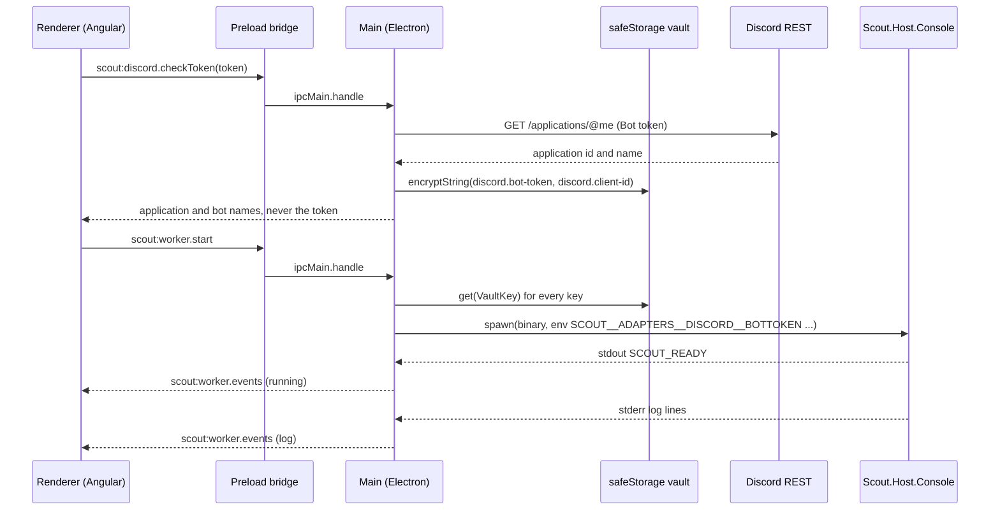

# Desktop UI

> Onboards a chat bot, stores its secrets, launches and supervises the .NET worker, and manages local models; it never calls the LLM itself.

## To change here, read

- [[pages/invariants/secrets-never-in-source]] - credentials go to the OS keychain through `safeStorage`, never to a file in the repo.
- [[pages/invariants/no-executive-writes]] - the UI is the one place Scout mutates the host on the user's behalf (model pulls, worker process); the ADR does not yet classify this.
- [[pages/decisions/0004-web-stack-angular]] and [[pages/decisions/0005-scout-desktop-m1-scope]] - the stack and the M1 deferrals.
- [[pages/decisions/0011-backend-frontend-grpc-uds]] - the transport; the Features screen uses it, the Providers screen does not yet (see Control plane below).
- [[pages/roadmap/control-plane-client]] - the open initiative that moves the remaining screens.
- [[pages/decisions/0019-github-app-device-flow]] - the GitHub sign-in that main owns.
- [[pages/decisions/0030-youtube-plugin-read-only-with-browser-sign-in]] - the YouTube sign-in through the browser, or the pasted key, that main owns.
- [[pages/decisions/0032-per-feature-write-permissions]] - features declare their writes, the owner grants them on the Features screen and approves each irreversible action on the Review screen.
- [[pages/decisions/0033-channel-operator-architecture]] - the operator's state lives in the control plane; the Production screen reads and edits it there and holds no pipeline logic.
- [[pages/decisions/0020-kubernetes-from-local-kubeconfig]] - the Kubernetes contexts main reads from the owner's kubeconfig.
- [[pages/decisions/0021-allowed-users]] - the allowed-users list main keeps and passes to the worker.
- [[pages/decisions/0022-discord-setup-from-the-bot-token]] - how the wizard sets up the Discord bot, and why its one PATCH is Scout's own configuration.
- [[pages/decisions/0023-slack-setup-from-a-manifest]] - the Slack app manifest and the two tokens main checks and keeps.
- [[pages/decisions/0027-desktop-presence]] - the tray, keep running, start at login and the three notifications, and why the autostart entry is Scout's own configuration.
- [[pages/decisions/0028-local-quick-ask-assistant]] - the quick-ask window, its shortcut, the microphone and the stdio transport to the worker.
- [[pages/conventions/testing]] - `bun run test` per package, Vitest in the renderer.

## Responsibility

Owns: first-run wizard that sets up the Discord bot from its token, the Slack setup, the GitHub sign-in and its token refresh, the YouTube sign-in and its token refresh, finding the owner's kubeconfig and keeping the contexts the owner allowed, the credential vault, worker lifecycle and log streaming, detection of installed chat clients and local inference backends, Ollama and Whisper model downloads, the tray, keep running and start at login, packaging.

Also owns the quick-ask window: the global shortcut that opens it, the microphone capture and WAV encoding in the renderer, and the questions main writes to the worker's stdin ([[pages/services/adapter-local]] answers them).

Also owns the lifecycle of [[pages/services/host-control-plane]] and the gRPC client the Features, Review and Production screens use to reach it.

Does not own: any conversation, LLM call or plugin; those live in [[pages/services/host-console]] and behind it.

## Layout

Four Bun packages under `ui/packages/`:

| Package | Role | Built with |
|---|---|---|
| `shared` | IPC channel names, request and response types, `VaultKey` union, the version compare and download pick | type-only |
| `main` | Electron main process: IPC handlers, vault, supervisor, Discord REST calls, OAuth loopback (ChatGPT sign-in), tray | `bun build` to ESM |
| `preload` | Context bridge that exposes the typed channels to the renderer | `bun build` to CJS |
| `renderer` | Angular 22 app: wizard, chat, sources, features, production, review, llm, logs and settings screens | `ng build` |

Packaging: `ui/build/scripts/publish-worker.sh:14` lists the two hosts, `Scout.Host.Console` and `Scout.Host.ControlPlane`, and publishes each self-contained single-file per RID into the same `ui/build/worker/<rid>/` folder (`publish-worker.ps1` does the same). `ui/build/electron-builder.yml:40` copies `src/Scout.ControlPlane.Contracts/protos/*.proto` into `resources/protos`, because the client loads the protos at runtime. The electron-builder config targets AppImage and deb on Linux, dmg on macOS, nsis on Windows, and names every package `Scout-Desktop-<version>-<os>-<arch>.<ext>` without a space (`ui/build/electron-builder.yml:7`), because GitHub rewrites spaces in release asset names. A version tag such as `v1.2.3` runs `.github/workflows/release.yml`, which writes the tag's version into `ui/package.json` on the runner (the repository keeps a placeholder `0.0.1`), builds the AppImage, the deb, the Apple silicon dmg and the Windows installer and publishes them as a GitHub Release with one `SHA256SUMS-<os>.txt` per platform; the project site links to them ([[pages/decisions/0029-project-site-and-releases]], [[pages/runbooks/release]]). The control-plane host runs with the worker folder as its working directory, so it also reads the console host's `appsettings.json`; no section overlaps today (the console reads `Scout:Llm`, the control plane `Scout:Providers`, `Scout:Features` and `Scout:LocalRuntime`).

## Public contract

- **IPC channels** - 105 `scout:*` channels declared in `ui/packages/shared/src/ipc-contract.ts:5`, grouped as detect, discord, vault, worker, app, diagnostics, llm, whisper, shell, providers, features (with `scout:features.writeGrant`, `ui/packages/shared/src/ipc-contract.ts:54`), actions and writes (`scout:actions.list`, `approve`, `reject`, the pushed `changed`, and `scout:writes.list`, `:56`), operator (`scout:operator.mandate`, `saveMandate`, `projects`, `project`, `startProject` and `decideClaim`, `ui/packages/shared/src/ipc-contract.ts:61`), chatgpt, github, youtube, kubernetes, access, slack, desktop, update (`scout:update.getState`, `setCheckEnabled`, `checkNow`, `skipVersion`, `remindLater`, `install` and the pushed `notice` and `progress`, `ui/packages/shared/src/ipc-contract.ts:103`) and local (`scout:local.ask`, `cancel`, `getTurns`, `clearTurns`, `turns`, `hide`, `getShortcut`, `setShortcut`, `open`, `getBubble`, `setBubble`, `ui/packages/shared/src/ipc-contract.ts:92`). Two channels call a cloud LLM provider, both a `GET` of its model list: `scout:providers.validateKey` (`ui/packages/main/src/ipc/provider-keys.ts:44`) checks an API key before it is stored, and `scout:llm.listModels` (`ui/packages/main/src/ipc/provider-keys.ts:161`) lists a connected provider's chat models with the stored key. `scout:vault.getPublic` (`ui/packages/main/src/ipc/vault.ts:89`) is the renderer's only vault read, limited to `llm.provider` and `llm.cloud-model`. The renderer sees only what `ui/packages/preload/src/preload.ts` bridges.
- **Vault keys** - the closed `VaultKey` union in `ui/packages/shared/src/client-kinds.ts:3` (Discord bot token, client and guild ids, LLM provider, model and endpoint, one API key per cloud provider (`llm.openai.api-key`, `llm.gemini.api-key`), the legacy shared `llm.api-key` kept only for migration, cloud model, STT provider and model, TypeSafe guard API key `guard.typesafe-api-key`). Main-only keys (`ui/packages/main/src/vault/safe-storage-vault.ts:6`), not in `VAULT_KEYS` so the renderer's vault channels reject them: `chatgpt.session`, `chatgpt.client-id`, `chatgpt.host-id`, `github.session`, `github.token`, `youtube.session`, `youtube.api-key`, `kubernetes.selection`, `access.allowed-users`, `slack.connection`, `app.keep-running`, `app.tray-notice-shown`, `quick-ask.shortcut`, `quick-ask.bubble`, `quick-ask.window`, `update.check-enabled`, `update.skipped-version` and `update.last-check`.
- **Cloud LLM cards** - the OpenAI API and Google Gemini cards on the AI Sources screen have three states (`ui/packages/renderer/src/app/sources/sources.component.ts:1187`): Not Connected (Connect opens a key form; the key is checked with the provider, then stored under that provider's own vault key), Connected (Disconnect, Change key) and In use (the model, Disconnect). AI Sources only connects and disconnects: a connected card shows the link "Choose a model in Models → Analysis" (`/llm?tab=analysis`) instead of a Use button or a model field, and the model is chosen on the Models screen (see Models → Analysis below). The first connect while no cloud provider is in use also makes that provider the one in use; disconnecting the provider in use switches to the other connected cloud provider or, with none left, to provider `None` (Scout replies that no AI provider is connected), never to Ollama, and restarts a running worker. The Ollama card offers Use while its server answers and then shows In use; Ollama and LM Studio have no Disconnect. OpenRouter and Custom API stay disabled. [[pages/decisions/0015-cloud-llm-providers-by-api-key]], [[pages/decisions/0017-provider-connect-disconnect]]. The OpenAI (also on ChatGPT Plus), Gemini, OpenRouter and Ollama cards show the brand marks from Simple Icons 15.22.0, licensed CC0-1.0, in the `ICONS` map (`ui/packages/renderer/src/app/sources/sources.component.ts:72`); LM Studio and Custom API keep generic icons. The marks are the providers' trademarks; CC0 covers the drawing data only.
- **ChatGPT Plus card** - ChatGPT Plus signs in through the system browser with OpenAI's Sign in with ChatGPT ([[pages/decisions/0018-chatgpt-plan-sign-in]]): the main process runs the OAuth flow (`ui/packages/main/src/oauth/chatgpt-auth.ts:77`), keeps the session in main-only vault keys (`ui/packages/main/src/vault/safe-storage-vault.ts:6`), refreshes it, and writes the access token to a 0600 file the worker reads; the renderer works through `scout:chatgpt.signIn`, `listModels`, `cancelSignIn`, `signOut` and `status` (`ui/packages/shared/src/ipc-contract.ts:11`). The card offers Continue with ChatGPT, Cancel while waiting for the browser, the link "Choose a model in Models → Analysis" while plan usage is granted, and Sign out; it has no model select and does not load the model list. A signed-in plan with plan usage counts as a connected cloud provider for the rule above (`ui/packages/renderer/src/app/core/llm-config.store.ts:298`): signing in while no cloud provider is in use makes it the one in use with `gpt-5.6-luna` (`ui/packages/renderer/src/app/sources/sources.component.ts:1126`), and signing out while it is in use switches to another connected cloud provider or to `None` through the same path as Disconnect (`:1135`, `ui/packages/renderer/src/app/core/llm-config.store.ts:308`).
- **Models → Analysis** - the Analysis tab of the Models screen (route `llm`, opened on Analysis by `?tab=analysis`, `ui/packages/renderer/src/app/models/models.component.ts:639`) is where the chat model is chosen. It shows the downloaded local models in the On Device block, as before, and one block per connected cloud provider (ChatGPT Plus while signed in with plan usage, OpenAI API and Google Gemini while their key is stored); a provider that is not connected shows no block and its list is never requested (`:678`). On open it reloads the provider state from the vault and the ChatGPT status, then fills each block from `scout:chatgpt.listModels` or `scout:llm.listModels` (`:688`, `:756`); a block whose list fails says "Could not load the <provider> model list." Main keeps OpenAI ids starting with `gpt-`, `o` or `chatgpt-` and drops embedding, whisper, tts, dall-e, moderation, realtime, audio, image, transcribe and search ids, and keeps Gemini models whose `supportedGenerationMethods` include `generateContent`, with the id without `models/` and the API's display name (`ui/packages/main/src/ipc/provider-keys.ts:123`, `:138`); errors arrive as `providers/key-rejected`, `providers/unreachable`, `providers/request-failed` or `providers/not-connected`. Clicking a cloud model writes `llm.cloud-model` and `llm.provider` through `LlmConfigStore.use` (`ui/packages/renderer/src/app/models/models.component.ts:740`); clicking a local model writes `llm.provider = Ollama` through `LlmConfigStore.useOllama` and then `llm.model`, leaving `llm.endpoint` as it is (`ui/packages/renderer/src/app/models/models.component.ts:723`); both restart a running worker after the writes. Exactly one model is marked Selected across the blocks: the cloud model of the provider in use, or the local selection while the provider is Ollama or unset (`ui/packages/renderer/src/app/models/models.component.ts:667`), because a blank provider means Ollama to the worker.
- **TypeSafe (Jev) card** - a key-only form on the same screen (`ui/packages/renderer/src/app/sources/sources.component.ts:1041`) stores the read-only guard key under `guard.typesafe-api-key` and never touches `llm.provider` (`:1331`); the badge reads Connected from `vault.has` on load (`:1379`). If that check fails, the card shows "Could not check the TypeSafe key; the read-only guard may still be on." in an alert and still offers Disconnect, so a key that exists can be removed. While Connected (or after a failed check), a Disconnect button (`:538`) deletes only that key, turns the badge Not Connected and says "Disconnected. The read-only guard is off." without any "Saved." text (`:1357`). Saving and disconnecting both restart a running worker through the same helper as the cloud cards (`:1423`); a failed store or delete shows the error in an alert and leaves the badge as it was. `buildEnv` passes the key as `SCOUT__GUARD__TYPESAFE__APIKEY` for every provider (`ui/packages/main/src/worker/build-env.ts:96`). [[pages/decisions/0016-jev-read-only-guard]].
- **GitHub card** - "Connect with GitHub" on the Features screen, see GitHub connection below. [[pages/decisions/0019-github-app-device-flow]].
- **Kubernetes card** - "Use the Kubernetes configuration on this computer?" on the Features screen, see Kubernetes connection below. [[pages/decisions/0020-kubernetes-from-local-kubeconfig]].
- **YouTube card** - "Sign in with Google" or "Use an API key" on the Features screen, see YouTube connection below. [[pages/decisions/0030-youtube-plugin-read-only-with-browser-sign-in]].
- **Worker handshake** - the main process spawns the worker binary (`ui/packages/main/src/worker/supervisor.ts:220`) and waits for the `SCOUT_READY` marker on stdout (`ui/packages/main/src/worker/log-stream.ts:17`); readiness times out after 45 s. A `SCOUT_PAIRED=<userId>` or `SCOUT_PAIRING_BURNED` line on stdout, never stderr, goes to the pairing handlers (`:52`, `:54`, see Allowed users). A `SCOUT_LOCAL ` line on stdout goes to the quick-ask router only and never into the log ring, the log viewer or the diagnostics export (`ui/packages/main/src/worker/log-stream.ts:34`); main writes quick-ask questions to the worker's stdin through `writeStdin` (`ui/packages/main/src/worker/supervisor.ts:370`), see Quick ask.
- **Routes** - `''`, `provision`, `token`, `oauth`, `launch`, `ready`, `status`, `sources`, `sources/local-models`, `features`, `production`, `review`, `llm`, `logs`, `slack`, `settings`, `chat`, `quick-ask` and `floating-button` in `ui/packages/renderer/src/app/app.routes.ts:10`; `status` only redirects to `logs` (`:40`), and `logs` redirects to `settings` while Logs is hidden from the menu (`:69`); `quick-ask` (`:87`) and `floating-button` (`:91`) render without the wizard shell (`ui/packages/renderer/src/app/app.component.ts:21`).

## How it works

```mermaid
sequenceDiagram
    participant R as Renderer (Angular)
    participant P as Preload bridge
    participant M as Main (Electron)
    participant V as safeStorage vault
    participant D as Discord REST
    participant W as Scout.Host.Console
    R->>P: scout:discord.checkToken(token)
    P->>M: ipcMain.handle
    M->>D: GET /applications/@me (Bot token)
    D-->>M: application id and name
    M->>V: encryptString(discord.bot-token, discord.client-id)
    M-->>R: application and bot names, never the token
    R->>P: scout:worker.start
    P->>M: ipcMain.handle
    M->>V: get(VaultKey) for every key
    M->>W: spawn(binary, env SCOUT__ADAPTERS__DISCORD__BOTTOKEN ...)
    W-->>M: stdout SCOUT_READY
    M-->>R: scout:worker.events (running)
    W-->>M: stderr log lines
    M-->>R: scout:worker.events (log)
```

The vault to environment mapping is `ui/packages/main/src/worker/build-env.ts`; at app start `migrateLegacyApiKey` (`ui/packages/main/src/worker/build-env.ts:190`, called from `ui/packages/main/src/main.ts:291`) moves a legacy shared cloud key into the active provider's own slot; the binary is resolved per platform and packaging mode in `ui/packages/main/src/worker/resolve-binary.ts:38`. Crash handling is a bounded restart policy with backoff (`ui/packages/main/src/worker/supervisor.ts:161`); a crash after which no restart is scheduled carries `gaveUp: true`. `stop()` cancels a scheduled restart and resolves at once when no worker process is alive, so Quit exits during the backoff or after a crash (`ui/packages/main/src/worker/supervisor.ts:331`).

## Control plane

At app start `ui/packages/main/src/main.ts:575` calls `connectControlPlane` (`ui/packages/main/src/control-plane/launcher.ts:231`). It launches the host through `launchControlPlane`, waits up to 10 s for the socket file (`ui/packages/main/src/control-plane/launcher.ts:190`), then opens the gRPC client with the protos from `resolveProtoDir` (`ui/packages/main/src/worker/resolve-binary.ts:70`): `resources/protos` when packaged, the source tree otherwise. Any failure on the way, whether a missing binary, a host that exits, a socket that never appears, an insecure socket directory or `win32`, becomes `ControlPlaneUnavailableError` on the client promise and one `warn` log line; the app keeps running. A failure after the spawn kills the host it started, and a host that exits mid-session closes the client so later calls fail at once. `before-quit` closes the client and kills the host (`ui/packages/main/src/shell/app-lifecycle.ts:140`, `ui/packages/main/src/main.ts:219`). There is no restart: a host that dies stays down until the app restarts.

The launcher mints two tokens: the desktop token, which only the host and the main process hold, and a worker token for the host's WorkerGate service ([[pages/services/host-control-plane]]). Neither is set on the main process's own environment. While the host is launched, `connection.workerGate()` gives the socket path and the worker token; `null` when the launch was unsupported or failed or the host exited (`ui/packages/main/src/control-plane/launcher.ts:268`).

The Features IPC handlers (`ui/packages/main/src/ipc/features.ts:60`) call that client: list, set credentials, setup, delete credentials, enable and disable map one to one onto the `scout.controlplane.v1.Features` RPCs, and the client maps the wire messages onto the `FeatureDto` shapes in `ui/packages/shared/src/ipc-contract.ts`. What the owner sees:

- **Control plane not running:** "The Scout control plane is not running, so features cannot be shown." (`ui/packages/renderer/src/app/features/features.component.ts:46`).
- **Running:** the GitHub, Kubernetes and YouTube cards, and under the grid two notes: "GitHub, Kubernetes and YouTube are used by the chat bot once connected." and "A feature that writes lists its write permissions on its card and writes only after you allow them; actions that cannot be undone wait for you on the Review screen." (`ui/packages/renderer/src/app/features/features.component.ts:88`). All three cards show a main-owned connection instead of the control-plane toggle and credential dialog, so no card in the catalog reaches `Enable` today; the host would answer `UNIMPLEMENTED` (it registers `NullFeatureActivator`), which the client maps to `ControlPlaneNotImplementedError` and a card would show as "Turning this feature on is not available yet." See [[pages/roadmap/followups]]. The YouTube card also carries the write permissions, see Write permissions below.

**Error codes across IPC.** Electron forwards only the message of an error thrown in an `ipcMain.handle` handler; a `code` property set in main never reaches the renderer (checked on Electron 41.3.0: the renderer receives `Error invoking remote method '<channel>': Error: <message>` with no `code`). The Features handlers therefore write the code into the message through `encodeIpcErrorMessage` (`ui/packages/shared/src/errors.ts:260`), and the store reads it back with `readIpcError` (`ui/packages/shared/src/errors.ts:268`). The other handlers still rely on the `code` property, so their code-based renderer branches never fire in the running app; see [[pages/roadmap/followups]].

The Providers handlers still call the worker over HTTP through `ui/packages/main/src/worker/http-client.ts:43`, whose endpoint comes from a `SCOUT_HTTP=` stdout line (`ui/packages/main/src/worker/log-stream.ts:18`) that only the retired `src/old/Scout.Host.Worker` printed, so the Providers screen still shows its unavailable state. The main process also still pulls Ollama models (`ui/packages/main/src/ipc/llm-pull.ts`) and downloads Whisper weights (`ui/packages/main/src/ipc/whisper.ts`) itself, from Node. At every worker start `findBestWhisperModel` (`ui/packages/main/src/worker/whisper-model.ts:13`) picks `ggml-large-v3-turbo.bin`, else `ggml-large-v3.bin`, from `userData/whisper-models`, skipping an empty file, and `buildEnv` passes it as `SCOUT__TRANSCRIPTION__MODELPATH` (`ui/packages/main/src/worker/build-env.ts:88`), nothing when none is installed, so Discord voice messages are transcribed locally ([[pages/decisions/0024-voice-messages-transcribed-locally]]). A model downloaded while the worker runs is used from the next worker start.

## Write permissions

[[pages/decisions/0032-per-feature-write-permissions]] on the desktop side. The client maps each scope row's `access` (0 read, 1 write, 2 irreversible) and the feature's `write_class` (0 none, 1 descriptive, 2 executive), `granted` and `granted_at` onto `FeatureScopeRowDto.access` and `FeatureDto.writeClass`, `granted`, `grantedAt` (`ui/packages/shared/src/ipc-contract.ts:447`, `:456`; `ui/packages/main/src/control-plane/client.ts:189`); an unknown value maps to the stricter `irreversible` or `executive`.

- **The card.** A feature whose `writeClass` is not `none` shows a Permissions block under its connection (`ui/packages/renderer/src/app/features/feature-card.component.ts:49`): one line per scope row with a `read`, `write` or `irreversible` badge, and "Write permission: not granted" or "Write permission: granted on <yyyy-MM-dd>". Today that is the YouTube card only; the catalog declares `youtube` as `executive`. On a connection card the block offers "Allow writes", disabled until the card is connected (a Google sign-in or a key), and, once granted, "Revoke writes" (`:85`, `:95`).
- **Write-verb allow-list.** Two channels carry "write" in their names and are allowed by the contract test's write-verb scan (`ui/packages/shared/test/ipc-contract.test.ts`): `scout:writes.list` reads the log of writes Scout already made and changes nothing; `scout:features.writeGrant` records the owner's grant or revocation in Scout's own feature state and calls no external system.
- **The grant.** "Allow writes" opens `sc-write-confirmation-dialog` (`ui/packages/renderer/src/app/features/write-confirmation-dialog.component.ts:99`), which lists the write rows only and says "Scout will be allowed to perform these writes on your behalf. Actions marked irreversible will still wait for your approval, one by one, on the Review screen." with Cancel and "Allow these writes"; it reuses the credential dialog's `DIALOG_STYLES` (`ui/packages/renderer/src/app/features/credential-dialog.component.ts:14`). Only "Allow these writes" calls `scout:features.writeGrant` with `{ granted: true, confirmWrites: true }`, which maps onto the `SetWriteGrant` rpc; "Revoke writes" sends `{ granted: false, confirmWrites: false }` with no dialog (`ui/packages/renderer/src/app/features/features.component.ts:209`, `ui/packages/renderer/src/app/core/features.store.ts:93`). Main forwards `granted` and `confirmWrites` only when they are the boolean `true` (`ui/packages/main/src/ipc/features.ts:155`).
- **A toggle feature.** The same dialog guards the toggle of a write-capable feature that has no main-owned connection: turning it on opens the dialog and only "Allow these writes" calls `scout:features.enable` with `confirmWrites: true`; cancelling leaves the checkbox off, because the card resets the checkbox to the feature's state before it asks (`ui/packages/renderer/src/app/features/feature-card.component.ts:115`, `ui/packages/renderer/src/app/features/features.component.ts:201`). A read-only feature toggles as before, with `confirmWrites: false`.
- **A refusal.** The control plane answers `FAILED_PRECONDITION` "Confirm the writes of <id> before enabling it" or "... before granting them", followed by the write rows. The client turns exactly that message into `ControlPlaneWriteConfirmationError` (`control-plane/write-confirmation-required`, `ui/packages/shared/src/errors.ts:125`, `ui/packages/main/src/control-plane/client.ts:405`); a `FAILED_PRECONDITION` for missing credentials stays as it was. The card shows the message.
- **Credentials follow the grant.** Any change or loss of the YouTube credential revokes the `youtube` write grant on the control plane before the worker restarts: sign-out and removing the only API key (`ui/packages/main/src/ipc/youtube.ts:64`, `:74`), a completed sign-in, a saved key and Google refusing the saved sign-in on refresh (`ui/packages/main/src/oauth/google-auth.ts:319`, `:217`, `:486`). The revoke is best-effort (`ui/packages/main/src/ipc/youtube.ts:17`): a control plane that does not answer is logged with the error code only and never blocks the credential change. Once the control plane confirms a revoke, main pushes `scout:features.changed` to every window (`ui/packages/main/src/ipc/youtube.ts:28`, `ui/packages/main/src/main.ts:363`, `ui/packages/shared/src/ipc-contract.ts:55`), and `FeaturesStore` reloads the features on it (`ui/packages/renderer/src/app/core/features.store.ts:45`), so the YouTube card stops showing writes allowed without the owner reopening the screen (`ui/packages/main/test/ipc-youtube.test.ts:206`, `ui/packages/renderer/src/app/core/features.store.spec.ts:103`); a revoke that failed pushes nothing. Deleting a feature's credentials restarts the worker so the revoked grant leaves it (`ui/packages/main/src/ipc/features.ts:111`). The owner allows writes again after reconnecting.
- **The worker.** At every worker start `readGrantedWriteFeatures` (`ui/packages/main/src/worker/build-env.ts:138`) lists the features and `buildEnv` passes the granted ids as `SCOUT__FEATURES__GRANTEDWRITES`, comma-separated, and always sets it, empty when nothing is granted, so a value inherited from the desktop's environment cannot grant writes (`:89`); the worker's guard reads it. A worker started while the control plane is still connecting waits for its client up to 10 s, the same bound as the socket wait, and then gets the grants (`ui/packages/main/src/worker/build-env.ts:151`, `ui/packages/main/src/main.ts:472`, `ui/packages/main/test/worker-build-env.test.ts:884`); one that does not connect in that time, is not launched, or does not answer starts with no grants and one `warn` line (`ui/packages/main/test/worker-build-env.test.ts:908`). A grant, a revocation, and enabling or disabling a write-capable feature restart a running worker so the guard sees the change (`ui/packages/main/src/main.ts:591`). An enable with `confirmWrites: true` that fails restarts it too, because the host clears the grant when the activation fails (`ui/packages/main/src/ipc/features.ts:129`, `ui/packages/main/test/ipc-features.test.ts:261`). The host records a grant on `Enable` only after the feature's activation succeeds, so the phase 1 "not available yet" answer leaves no grant behind. The same `buildEnv` always sets `SCOUT__WORKERGATE__SOCKETPATH` and `SCOUT__WORKERGATE__TOKEN` from `workerGate()` (`ui/packages/main/src/worker/build-env.ts:90`, `ui/packages/main/src/main.ts:476`), empty strings while the control plane is not launched, so values inherited from the desktop's environment cannot point the worker elsewhere; the worker asks the control plane through that gate before a declared write ([[pages/services/host-console]]). Overwriting the exact upper-case names is not enough on its own, because the worker's configuration reads a key in any casing, with ':' or '__', and with a `DOTNET_` prefix: the supervisor builds the child environment from `workerInheritableEnv(process.env)` (`ui/packages/main/src/worker/supervisor.ts:212`, `:396`), which drops every inherited key that normalizes (lower case, ':' to '__', a leading `dotnet_` or `aspnetcore_` removed) to `scout__workergate__*`, `scout__features__grantedwrites`, `scout_controlplane_token` or `scout_controlplane_worker_token`, and then applies `buildEnv`'s values (`ui/packages/main/test/worker-supervisor.test.ts:357`). The worker's environment never carries `SCOUT_CONTROLPLANE_TOKEN` or `SCOUT_CONTROLPLANE_WORKER_TOKEN`, and no value in it holds the desktop token (`ui/packages/main/test/worker-build-env.test.ts:969`); the empty values are pinned at `:949`. A worker started before the host is launched gets the empty gate, like the grants above, until its next start.

## Review

The Review screen (route `review`, menu entry Review between Production and Logs, `ui/packages/renderer/src/app/shell/post-connect-shell.component.ts:50`) is the one place the owner decides on an irreversible action ([[pages/decisions/0032-per-feature-write-permissions]]); chat cannot approve. `ui/packages/renderer/src/app/review/review.component.ts` has two sections:

- **Waiting for your approval** - each pending action with its feature, action, target, summary and request time, a reason field, and Approve and Reject. A decision goes to `scout:actions.approve` or `scout:actions.reject` with the trimmed reason when there is one, and the control plane keeps the reason with either decision; then the screen reloads (`:261`). The list holds pending actions only: an approved, a rejected and an `executed` action (approved and recorded by the worker, `ui/packages/shared/src/ipc-contract.ts:505`) all leave it the same way. Empty: "Nothing is waiting. Actions that cannot be undone will appear here before Scout performs them."
- **Recent writes** - the last 50 entries of `scout:writes.list`, newest first (`:287`): time, feature, action, target, outcome, approved by. Empty: "Scout has not written anything yet."

The screen loads both lists on open, reloads on `scout:actions.changed`, which main pushes to every window after an approval or a rejection (`ui/packages/main/src/main.ts:593`, `:201`), and every 15 s while it is open. A failed load shows the error above the sections and keeps the last lists. Phase 1 has no feature that queues an action or writes, so both sections show their empty state.

## Production

The Production screen (route `production`, menu entry Production between Features and Review, `ui/packages/renderer/src/app/shell/post-connect-shell.component.ts:50`, `ui/packages/renderer/src/app/app.routes.ts:55`) is the desktop side of the channel operator ([[pages/roadmap/youtube-channel-operator]] phase 2, [[pages/decisions/0033-channel-operator-architecture]]). It reads and edits the operator's state in the control plane and holds no pipeline logic; the worker researches and writes the script. `ui/packages/renderer/src/app/production/production.component.ts:518` has four parts:

- **Mandate** (`:51`) - objective, audience, up to five pillars, cadence, language, voice and style, blocked topics as a comma list, the target metric (Views, Watch hours, Subscribers or Engagement, stored as `views`, `watch_hours`, `subscribers`, `engagement`, `:27`) and the target value. Save sends every field trimmed, the filled pillars only and the blocked topics split on commas to `scout:operator.saveMandate` (`:573`), then shows "Saved <yyyy-MM-dd HH:mm>". With no mandate saved: "The operator needs a mandate before it makes a video: what the channel is for, who it is for and its language. Fill it in and save it." A refused save shows the reason.
- **Make a video** - a topic and the button, disabled under 3 characters; `scout:operator.startProject` with the trimmed topic, then the queued project's topic and status under the field (`:598`). Without the owner's YouTube write grant the control plane refuses the start, and the reason, "The owner has not allowed youtube to write; allow it on the Features screen of Scout Desktop.", shows under the field.
- **Projects** - the last 50 from `scout:operator.projects`, newest created first (`:677`), each with its topic, status badge and updated time. Empty: "No videos yet. Ask for one above, or ask Scout in chat."
- **Project detail** (`:224`), on a click, from `scout:operator.project`: the error if the pipeline failed, the topic candidates (title, fit as a percentage, reason), the script (hook, sections with heading and narration, call to action, title variants, description, tags, chapters) and the claims (text, risk, status, the owner's note, source URLs). Each with its own empty state. Supported and Unsupported send that status to `scout:operator.decideClaim`; Waive opens a note field and "Waive claim" stays disabled until the note has text, then sends `waived` with the trimmed note (`:625`). A source URL is shown as text with a Copy button (`:292`), never as a link: the URLs come from the model and the web, and `scout:app.openExternal` allows only a fixed list of hosts.

The screen loads the mandate once, and the list on open and every 10 s while it is open (`:22`, `:673`). The list carries whole projects, so each refresh takes the selected project's detail from it and reads that project with `scout:operator.project` only when it is no longer in the list; a click on a project reads it once. A failed load shows the error above the sections and keeps the last list and project.

In main, `registerOperatorHandlers` (`ui/packages/main/src/ipc/operator.ts:80`, wired at `ui/packages/main/src/main.ts:596`) validates before calling the control plane, with the control plane's own messages: the objective and the language are required, at most 5 pillars of at most 80 characters (`:58`); a topic is 3 to 200 characters after trimming (`:140`); a claim is `supported`, `unsupported` or `waived`, and `waived` needs a note (`:158`); the project list asks for at most 200. A refusal reaches the renderer as `operator/invalid-request`. The client calls the six `scout.controlplane.v1.Operator` rpcs on the desktop token (`ui/packages/main/src/control-plane/client.ts:416`); it loads `operator.proto` with the other protos (`:341`), maps `INVALID_ARGUMENT` to `ControlPlaneInvalidArgumentError` (`control-plane/invalid-argument`), `PERMISSION_DENIED` to `ControlPlanePermissionDeniedError` (`control-plane/permission-denied`) and `NOT_FOUND` to `ControlPlaneNotFoundError` (`control-plane/not-found`), each carrying the control plane's message (`ui/packages/shared/src/errors.ts:132`, `:139`, `:146`), and answers a mandate with no `updated_at`, or a `NOT_FOUND`, as no mandate (`ui/packages/main/src/control-plane/client.ts:479`). The DTOs are `MandateDto`, `OperatorProjectDto` and `ClaimDecisionRequest` (`ui/packages/shared/src/ipc-contract.ts:540`, `:600`, `:633`).

## GitHub connection

The GitHub card does not use the control plane's credential dialog: `ui/packages/renderer/src/app/features/features.component.ts:61` projects `sc-github-connect` into the card and passes the card a `connection` state, so the GitHub card shows "Connected" or "Not connected" from the main-owned status instead of the control-plane badge, and has no toggle and no credential buttons (`ui/packages/renderer/src/app/features/github-connect.component.spec.ts:236`). The Kubernetes card works the same way, see Kubernetes connection. The component (`ui/packages/renderer/src/app/features/github-connect.component.ts:225`) calls five channels, `scout:github.signIn`, `status`, `cancel`, `signOut` and `saveToken`, handled in `ui/packages/main/src/ipc/github.ts:30`, and polls the status 3 s after each answer, never with two requests in flight and never after the card is gone, while a code is pending or the App is not installed and an install page exists. "Open GitHub" and "Install Scout on your GitHub account" go through the existing `scout:app.openExternal` allow-list (https, `github.com` only).

`GitHubAuth` (`ui/packages/main/src/oauth/github-auth.ts:91`) runs the device flow, keeps the session in the vault, writes `<userData>/github-token.json` with mode `0600` (`ui/packages/main/src/oauth/github-auth.ts:498`), refreshes every minute and when the system wakes from sleep (`powerMonitor` resume) once less than 5 minutes remain, through one serial queue so two checks never both rotate the token, and on disconnect or `bad_refresh_token` deletes the token file first and the vault session second; if the file cannot be removed the owner stays connected and sees "Could not remove the GitHub token file, so Scout is still connected. Try Disconnect again." (`ui/packages/main/src/oauth/github-auth.ts:482`). On connect and disconnect it calls `restartWorkerIfRunning` (`ui/packages/main/src/ipc/github.ts:15`). "Use a token" is the second method: main checks the pasted token against `GET /user`, keeps it under `github.token`, warns when a classic token's `X-OAuth-Scopes` can write, and removes any browser session, as a browser connect removes a saved token ([[pages/decisions/0019-github-app-device-flow]]). `GitHubAuth.workerEnv()` gives the worker `SCOUT__PLUGINS__GITHUB__TOKENFILE` for the browser method or `SCOUT__PLUGINS__GITHUB__TOKEN` for a pasted token, and nothing when disconnected (`ui/packages/main/src/main.ts:465`, `ui/packages/main/src/worker/build-env.ts:65`). What the owner sees:

- **No client id:** "The Scout GitHub App is not configured yet." and a disabled Connect button; "Use a token" still works.
- **Use a token:** a password field, Save, the helper text recommending a read-only fine-grained token and a "Create a fine-grained token" link. The client id and slug come from `SCOUT_GITHUB_APP_CLIENT_ID` and `SCOUT_GITHUB_APP_SLUG`, else from constants that are empty until the App is registered.
- **Pending:** the one-time code in large type, Open GitHub, Copy code and Cancel.
- **Connected:** "Connected as <login>" and Disconnect; for a write-capable classic token, "This token can write to your repositories. A read-only fine-grained token is safer."; for the browser method when the App has no installation, also "Install Scout on your GitHub account".
- **Failed:** the reason above Connect, for example "The sign-in was cancelled on GitHub." or "The code expired. Click Connect with GitHub to get a new one."

The GitHub card sits in the Features grid, so it is hidden with the grid when the control plane is not running, although the sign-in does not need it.

## Kubernetes connection

The Kubernetes card projects `sc-kubernetes-connect` (`ui/packages/renderer/src/app/features/kubernetes-connect.component.ts:251`) and gets a `connection` state like the GitHub card (`ui/packages/renderer/src/app/features/features.component.ts:180`), so it has no toggle and no credential dialog. It calls four channels, `scout:kubernetes.detect`, `use`, `status` and `disconnect`, handled in `ui/packages/main/src/ipc/kubernetes.ts:51`. `detectKubeconfig` (`ui/packages/main/src/kubernetes/kubeconfig.ts:32`) reads the first `KUBECONFIG` entry or `~/.kube/config` with `js-yaml` and returns each context's name, cluster, server, namespace, how its user signs in (token, client certificate, exec command, auth provider, username and password) and, for an exec user, the command and its arguments, with the value of any flag whose name contains secret, token, password, passwd, key or credential shown as `***` (`ui/packages/main/src/kubernetes/kubeconfig.ts:116`). It never returns or logs a token, key, certificate, password or exec env value; a malformed file logs only its path. `use` takes `{name, label}` pairs only, checks each name against the file main located itself and each label with the shared rule (`ui/packages/shared/src/kubernetes-labels.ts:9`), stores `{path, contexts: [{name, label}]}` under `kubernetes.selection` (a selection stored before labels reads with each name as its label) and restarts a running worker through `restartWorkerIfRunning`; `disconnect` deletes it and restarts the worker. `buildEnv` turns the selection into `SCOUT__PLUGINS__KUBERNETES__KUBECONFIGPATH` and `SCOUT__PLUGINS__KUBERNETES__CONTEXTS__<n>__NAME` and `__LABEL` (`ui/packages/main/src/worker/build-env.ts:66`), read at every worker start (`ui/packages/main/src/main.ts:467`) and used by the worker's [[pages/services/plugin-kubernetes]]. What the owner sees:

- **No kubeconfig:** "No Kubernetes configuration found on this computer (looked in $KUBECONFIG and ~/.kube/config)."
- **Unreadable kubeconfig:** "The Kubernetes configuration at <path> could not be read."
- **Detected:** "Use the Kubernetes configuration on this computer?", the path, one checkbox per context with its server and sign-in kind, "Runs <command> to get a token" under an exec context, and "Use selected contexts", disabled until a box is ticked. Under it, always: "Scout only reads from your clusters, but these credentials may allow changes. A read-only user is safer:" and three copyable `kubectl` commands that create a `scout-reader` service account bound to the `view` cluster role and a token for it.
- **Labels:** each ticked context gets a "Label" field prefilled with its name; an invalid or repeated label shows the reason under the list and disables "Use selected contexts". The chat bot and the model see only the labels ([[pages/decisions/0020-kubernetes-from-local-kubeconfig]]).
- **Connected:** "Using dev, qa, prod from <path>", the labels and never the context names or servers, and Disconnect.

## YouTube connection

The YouTube card projects `sc-youtube-connect` (`ui/packages/renderer/src/app/features/youtube-connect.component.ts:224`) and gets a `connection` state like the GitHub card (`ui/packages/renderer/src/app/features/features.component.ts:186`), so it has no toggle and no credential dialog (`ui/packages/renderer/src/app/features/features.component.spec.ts:165`). It calls six channels, `scout:youtube.signIn`, `status`, `cancelSignIn`, `signOut`, `saveApiKey` and `clearApiKey` (`ui/packages/shared/src/ipc-contract.ts:72`), handled in `ui/packages/main/src/ipc/youtube.ts:31`, and polls the status 3 s after each answer while a sign-in waits for the browser, never with two requests in flight and never after the card is gone.

`GoogleAuth` (`ui/packages/main/src/oauth/google-auth.ts:103`) owns both credentials, one at a time: a sign-in removes a saved key and a saved key signs out (revoking first), as on the GitHub card. [[pages/decisions/0030-youtube-plugin-read-only-with-browser-sign-in]].

- **Sign in with Google** (`ui/packages/main/src/oauth/google-auth.ts:153`): reads the OAuth client, finds a loopback port from 8765 (ten fallbacks), starts the listener on `127.0.0.1` with `/auth/callback` and only then opens the system browser at `accounts.google.com/o/oauth2/v2/auth` with PKCE S256, a `state`, `access_type=offline`, `prompt=consent` and the scopes `youtube.readonly` and `yt-analytics.readonly`. The call returns at once with `pending: true`; the answer completes in the background: main checks the state, exchanges the code at `oauth2.googleapis.com/token` with the client id and secret, reads the channel with `GET youtube/v3/channels?part=snippet&mine=true` (`:369`; an account without a channel is still connected, titled "No channel on this account"), and only then stores the session under `youtube.session` and writes the token file. A failure on the way stores nothing and lands in the status `error`.
- **OAuth client** (`ui/packages/main/src/oauth/google-auth.ts:532`): in this order: `SCOUT_GOOGLE_CLIENT_ID` and `SCOUT_GOOGLE_CLIENT_SECRET` when both are set; else `<userData>/google-oauth-client.json`, either the file Google Cloud Console downloads for a Desktop app client as it is (`{"installed": {"client_id": ..., "client_secret": ..., ...}}`) or the flat `{"client_id": ..., "client_secret": ...}`; else the client file packaged with the app, `packages/main/resources/google-client.json` under `app.getAppPath()` (`ui/packages/main/src/main.ts:377`; read once; written at package time from `SCOUT_GOOGLE_CLIENT_SECRET` by `ui/build/scripts/write-google-client.mjs`, gitignored, and in a release from the repository secret of the same name, see [[pages/runbooks/release]]); else the Desktop client built into Scout, `DEFAULT_GOOGLE_CLIENT_ID` and `DEFAULT_GOOGLE_CLIENT_SECRET` (`ui/packages/main/src/oauth/google-auth.ts:16`, passed from `ui/packages/main/src/main.ts:385`), when both are non-empty; the id ships in source, the secret stays empty and never enters the repository, so this last step only applies to a build that fills both. The status says which one is in use (`source`: `env`, `file`, `bundled`, `embedded` or null). Read at sign-in, at refresh and for the status; never logged, never stored in the vault, never sent to the renderer. With none of the three the status says `configured: false` and the card reads "Sign in needs a Google OAuth client: enable the YouTube Data API, create an OAuth client of type Desktop app, then download its JSON as it is to <path> (or write {"client_id": ..., "client_secret": ...} there). Or use an API key below.", with Sign in with Google disabled and two links opened through `scout:app.openExternal`: "Enable the YouTube Data API" (`https://console.cloud.google.com/apis/library/youtube.googleapis.com`) and "Open Google Cloud Console credentials" (`https://console.cloud.google.com/apis/credentials`, where both the Desktop OAuth client and an API key are created). A Web application client file (`{"web": ...}`) is not accepted: the card also says "The Google OAuth client in the file is a Web application; Sign in with Google needs an OAuth client of type Desktop app."
- **Token file**: `<userData>/youtube-token.json` as `{"access_token": ..., "expires_at": <unix ms>}`, mode `0600`, written to a `.tmp` file then renamed (`ui/packages/main/src/oauth/google-auth.ts:608`); a failed write keeps the session and is retried on the next refresh tick (`ui/packages/main/test/oauth-google.test.ts:477`). The worker gets its path as `SCOUT__PLUGINS__YOUTUBE__TOKENFILE`, or the key as `SCOUT__PLUGINS__YOUTUBE__APIKEY`, and either one turns on `SCOUT__ACCESS__REQUIREALLOWLIST` (`ui/packages/main/src/worker/build-env.ts:65`, `:79`, wired at `ui/packages/main/src/main.ts:466`).
- **Refresh** (`ui/packages/main/src/oauth/google-auth.ts:439`): every minute and when the system wakes from sleep, through one serial queue, once less than 5 minutes remain, with the client secret; Google's answer usually has no new refresh token, so the first one is kept. `invalid_grant` ends the session: the token file goes first, the vault entry second (`:588`), and the card says "Google no longer accepts the saved sign-in. Sign in with Google again." A 5xx or a network failure keeps the session for the next check.
- **Disconnect** (`ui/packages/main/src/oauth/google-auth.ts:183`): a best-effort `POST oauth2.googleapis.com/revoke` of the refresh token, then the token file, then the vault entry; if the file cannot be removed the owner stays connected and sees "Could not remove the YouTube token file, so Scout is still connected. Try Disconnect again." On a pasted key, Disconnect calls `clearApiKey`, which removes only the key. Connect and disconnect call `restartWorkerIfRunning` (`ui/packages/main/src/ipc/github.ts:15`).
- **Use an API key** (`ui/packages/main/src/oauth/google-auth.ts:201`): a password field, Save and the link "Create a key in Google Cloud Console" (`https://console.cloud.google.com/apis/credentials`, allowed in `ui/packages/main/src/ipc/app.ts:12`). Main checks the key with one public `GET youtube/v3/channels?part=id&forHandle=youtube&key=...` (`:414`): 200 stores it under `youtube.api-key`; a 400 or 403 stores nothing and says why, from the reasons in Google's error body (`ui/packages/main/src/oauth/google-auth.ts:664`): `API_KEY_INVALID` "Google does not recognise this API key. Copy it again from Google Cloud Console credentials."; `SERVICE_DISABLED` or `accessNotConfigured` "The YouTube Data API v3 is not enabled for this key's project. Enable it in Google Cloud Console and try again in a minute." followed by the project (`projects/<n>`) when Google names it; `API_KEY_SERVICE_BLOCKED` or `forbidden` "This key's restrictions do not allow the YouTube Data API v3. Edit the key's API restrictions in Google Cloud Console."; `quotaExceeded` "YouTube's daily quota for this key is spent; it resets at midnight Pacific time."; any other reason the generic "Google rejected this API key. Check that the YouTube Data API v3 is enabled for it." with the reason identifier in parentheses. Google's own message text is never shown. No message, log line or status carries the key.
- **Pending:** "Waiting for the browser..." and Cancel, which aborts the listener and releases the port without an error.
- **Connected:** "Connected to <channel title>" and "Signed in with Google", or "Connected with an API key" and "Public data only.", then "Open YouTube Studio" (`https://studio.youtube.com/channel/<channel id>`, or `https://studio.youtube.com/` without a channel id), "Open channel" (`https://www.youtube.com/channel/<channel id>`, only with a channel id; the status carries `channelId` from the session) and Disconnect; both links go through `scout:app.openExternal`, whose allow-list has `studio.youtube.com` and `www.youtube.com` (`ui/packages/main/src/ipc/app.ts:13`).
- **Failed:** the reason above Sign in with Google, for example "Google could not finish the sign-in (HTTP 503). Sign in again in a moment." or "The Google sign-in was cancelled or timed out. Click Sign in with Google to try again."

Like the GitHub card, it sits in the Features grid and is hidden with the grid when the control plane is not running.

## Discord setup

The wizard needs only the bot token ([[pages/decisions/0022-discord-setup-from-the-bot-token]]). Its three steps are the routes `provision` (open the Developer Portal), `token` and `oauth` (add the bot to a server). All Discord HTTP lives in `ui/packages/main/src/discord/discord-setup.ts`, which takes `fetch` as a parameter so tests can fake it:

- `checkBotToken` reads `GET /applications/@me` (`:62`).
- `enableMessageContent` adds `GATEWAY_MESSAGE_CONTENT_LIMITED` to the existing flags with one PATCH when the application is in under 100 servers. It returns the portal bot page otherwise (`:77`).
- `inviteUrl` builds a `scope=bot` invite with the permissions integer `309237730304` from six named constants, including Create Public Threads for the reply thread per conversation (`:27`, `:52`).
- `listGuilds` reads `GET /users/@me/guilds` (`:109`).

The handlers in `ui/packages/main/src/ipc/discord.ts` work as follows:

- The token arrives once through `scout:discord.checkToken` (`:61`).
- That handler stores the token as `discord.bot-token` and the application id as `discord.client-id` (`:75`). When the application differs from the stored one, it first deletes `discord.guild-id` and `discord.guild-name`. A token that replaces a different stored token restarts a running worker.
- The other handlers read the token from the vault, so the renderer never sends it again and never receives it.

The `token` step continues only once Message Content is on. The `oauth` step polls the bot's servers every 3 s, at most 100 times, until a new one appears. It then stores `discord.guild-id` and `discord.guild-name` (`ui/packages/renderer/src/app/wizard/oauth-install/oauth-install.component.ts:280`, stored at `:239`). The invite opens only after the first server list has loaded, so a server the bot was already in is never taken for the new one.

## Allowed users

Settings has a "Who can use Scout" section (`ui/packages/renderer/src/app/wizard/settings/settings.component.ts:40`): an id field with Add, the list with Remove per id, and the line "Discord: turn on Developer Mode, right-click a user, Copy User ID. Slack: profile, More, Copy member ID. Teams: the user's Bot Framework user ID, which starts with 29:." Add and Remove send the whole list through `scout:access.set`; a refused list shows main's reason and keeps the typed id. Main (`ui/packages/main/src/ipc/access.ts:73`) trims each id, accepts 1 to 64 characters from `[A-Za-z0-9._:@-]`, de-duplicates, caps the list at 50, stores it under `access.allowed-users` (deleted when empty) and restarts a running worker through `restartWorkerIfRunning` only when the list changed. `buildEnv` passes each id as `SCOUT__ACCESS__ALLOWEDUSERIDS__<n>` and sets `SCOUT__ACCESS__REQUIREALLOWLIST=true` when GitHub is connected, a Kubernetes selection exists or `llm.provider` is `ChatGptPlan` (`ui/packages/main/src/worker/build-env.ts:74`, `:77`), so the worker refuses everyone until ids are added ([[pages/decisions/0021-allowed-users]], [[pages/services/conversation]]). While the list is empty, the connected GitHub, Kubernetes and YouTube cards (`ui/packages/renderer/src/app/features/features.component.ts:77`) and the ChatGPT Plus card while it is the provider in use (`ui/packages/renderer/src/app/sources/sources.component.ts:291`) say "Nobody can use this connection from chat until you add allowed users in Settings."

"Pair from chat" in the same section (`ui/packages/renderer/src/app/wizard/settings/settings.component.ts:65`) calls `scout:access.startPairing`. Main draws a 6-digit code with `crypto.randomInt`, valid for 10 minutes, keeps it in memory only and restarts a running worker (`ui/packages/main/src/ipc/access.ts:114`). The renderer shows "Send `482913` to Scout in a direct message on Discord.", with the real code, which the worker also accepts as `pair 482913`; a refusal shows main's reason. While the code is pending, `buildEnv` adds `SCOUT__ACCESS__PAIRINGCODE` and `SCOUT__ACCESS__PAIRINGEXPIRESAT` (`ui/packages/main/src/worker/build-env.ts:84`). When the worker prints `SCOUT_PAIRED=<userId>`, the supervisor's `onPaired` (`ui/packages/main/src/main.ts:478`) calls `paired` (`ui/packages/main/src/ipc/access.ts:124`). That handler ignores the line unless an unexpired code is pending, clears the code, and adds the id through the same validation and storage as `scout:access.set`, which restarts the worker. On `SCOUT_PAIRING_BURNED` (the worker burned the code after it was sent outside a direct message or after five wrong codes) main drops the pending code (`ui/packages/main/src/ipc/access.ts:157`), and Settings, which listens to the worker's stdout events, replaces the code with "Pairing expired. Start again." (`ui/packages/renderer/src/app/wizard/settings/settings.component.ts:388`). No main log line carries the code. The list on screen does not refresh by itself; it shows the new id the next time Settings opens ([[pages/decisions/0021-allowed-users]]).

## Slack setup

The welcome screen's Slack card ("Set up", or "Connected" once Slack is connected) opens the `slack` route, and the Slack card under Chat clients in Settings expands the same `sc-slack-setup` component (`ui/packages/renderer/src/app/wizard/slack/slack-setup.component.ts:139`), so an owner who started with Discord adds Slack later ([[pages/decisions/0023-slack-setup-from-a-manifest]]). It calls four channels, `scout:slack.manifestUrl`, `save`, `status` and `disconnect`, handled in `ui/packages/main/src/ipc/slack.ts:58`. What the owner sees:

- **Step 1, Create the Slack app:** the button opens the link from `manifestUrl()` (`ui/packages/main/src/slack/slack-setup.ts:38`) through `scout:app.openExternal`, whose allow-list now includes `api.slack.com`, then four lines: pick the workspace and click Create; Install to Workspace and copy the Bot User OAuth Token; Basic Information, App-Level Tokens, Generate Token and Scopes with `connections:write`, copy the token; invite @scout to each channel where it should answer.
- **Step 2:** two password fields, "Bot User OAuth Token (xoxb-)" and "App-level token (xapp-)", and Save, disabled until both are filled. A refusal shows main's reason, for example "The bot token starts with xoxb-." or "Slack rejected the app-level token.", and keeps the form.
- **Connected:** "Connected to <team> as <botUser>" and Disconnect.

Main refuses a token without its prefix before any request, checks the bot token with `auth.test` and the app-level token with `apps.connections.open` (`ui/packages/main/src/slack/slack-setup.ts:58`, `:74`), and only then stores both tokens with the `auth.test` team and bot user as one entry, `slack.connection`, in a single vault write (so a failed write leaves the previous pair whole), and restarts a running worker through `restartWorkerIfRunning`. When no worker has started yet in this session, the renderer starts it after Save (`ui/packages/renderer/src/app/wizard/slack/slack-setup.component.ts:182`), so a Slack-only owner reaches a running Scout from the welcome screen. `readSlackTokens` (`ui/packages/main/src/ipc/slack.ts:34`) feeds `buildEnv`, which sets `SCOUT__ADAPTERS__SLACK__BOTTOKEN` and `SCOUT__ADAPTERS__SLACK__APPLEVELTOKEN` when both exist (`ui/packages/main/src/worker/build-env.ts:66`) and, since [[pages/decisions/0028-local-quick-ask-assistant]], starts even when neither is connected, with only the local adapter. Slack does not set `SCOUT__ACCESS__REQUIREALLOWLIST`.

`WizardStore` keeps the two platforms apart (`ui/packages/renderer/src/app/core/wizard.store.ts:63`, `:71`): `hasDiscord` drives the Discord card, and `hasProvisioning`, Discord, Slack or the local-only choice (see Quick ask), decides the post-connect shell and the welcome screen's worker start. Disconnect on the Discord card in Settings forgets only the Discord app (see Settings).

## Settings

Settings opens with Chat clients, then Scout worker, then "Who can use Scout", "Floating button and quick ask", Desktop, About and Theme (`ui/packages/renderer/src/app/wizard/settings/settings.component.ts:36`, `:38`, `:40`). There is no Status screen any more: its worker controls and its Reprovision moved here, the sidebar reads Chat, AI Sources, Models, Features, Production, Review, Logs, Settings (`ui/packages/renderer/src/app/shell/post-connect-shell.component.ts:14`), and the welcome screen's Connected or Error Discord card opens Settings (`ui/packages/renderer/src/app/wizard/welcome/welcome.component.ts:178`). The `ready` route stays as the first-run step that `launch` opens.

- **Chat clients** (`ui/packages/renderer/src/app/wizard/settings/chat-clients.component.ts:16`), one card per client, one action at a time per card:
  - **Discord.** Connected shows "Server: <name>" and Disconnect; not connected shows Connect, which opens the existing `provision` step (`:125`). Disconnect asks "This will disconnect Scout from Discord and forget the current Discord app. Continue?". On yes (`:134`) it stops a running worker, deletes the four `discord.*` vault keys through `WizardStore.reprovision` (`:144`) and, while Slack or the local-only choice still counts as provisioned, starts the worker again so they keep answering (`:149`); with nothing left it opens the welcome screen (`:146`). It never calls a Slack channel. A vault delete does not restart the worker in main, so the restart is the renderer's stop then start.
  - **Slack.** Connected shows `sc-slack-setup`'s "Connected to <team> as <botUser>" and Disconnect (see Slack setup); not connected shows Connect, which expands that setup in place (`:54`).
  - **Teams.** "Coming soon" and a disabled Connect.
- **Scout worker** (`ui/packages/renderer/src/app/wizard/settings/worker-settings.component.ts:21`): the state badge, PID, uptime (the same `formatUptime` the `ready` step uses, `ui/packages/renderer/src/app/core/uptime.ts:2`), restarts, and Stop and Restart while running, Stop while starting, Start otherwise, through `scout:worker.start` and `stop`, Restart being stop then start (`ui/packages/renderer/src/app/wizard/settings/worker-settings.component.ts:153`). "Show Logs in the menu" (`ui/packages/renderer/src/app/wizard/settings/worker-settings.component.ts:50`), on by default, is kept in `localStorage` as `scout:show-logs` (`ui/packages/renderer/src/app/core/menu-preferences.ts:21`); off drops Logs from the sidebar and sends `/logs` to Settings. Log verbosity is listed here as coming soon (`ui/packages/renderer/src/app/wizard/settings/worker-settings.component.ts:56`). The Logs screen stays a plain log viewer.
- **Who can use Scout** says "No one is listed yet. The list only matters once Discord or Slack is connected; chat on this computer never needs it." while the list is empty (`ui/packages/renderer/src/app/wizard/settings/settings.component.ts:86`); see Allowed users.

## Quick ask

The floating button, the quick-ask window, the shortcut, voice turns and the shared local conversation are described on [[pages/services/desktop-quick-ask]] ([[pages/decisions/0028-local-quick-ask-assistant]]).

## Desktop presence

Settings has a Desktop section with "Keep Scout running when the window is closed" (on by default) and "Start Scout when I log in" (off by default), served by `scout:desktop.getSettings`, `setKeepRunning` and `setStartAtLogin` (`ui/packages/main/src/ipc/desktop.ts:60`) ([[pages/decisions/0027-desktop-presence]]). `main.ts` creates the tray after the supervisor (`ui/packages/main/src/main.ts:485`): Open Scout, Ask Scout..., Start Scout or Stop Scout, Quit Scout, tooltip `Scout - <state>`, plus "Update available: <version>" and a tooltip suffix while a newer release is known (see Update notice). `installAppLifecycle` (`ui/packages/main/src/shell/app-lifecycle.ts:78`) owns `window-all-closed`, `before-quit`, `second-instance` and `activate`: with keep running on, closing the window hides it and the worker keeps running; Quit Scout goes through `app.quit()` and the same `before-quit` that stops the worker. If the tray cannot be created, keep running is off for the session and Settings says "This desktop has no system tray, so Scout quits when its window is closed." Start at login uses the OS login item on macOS and Windows and `~/.config/autostart/scout.desktop` on Linux (`ui/packages/main/src/shell/login-item.ts:44`); a login launch carries `--hidden`, which loads the window without showing it, so the welcome screen's worker auto-start still runs. Ask Scout... calls the quick-ask module's `openQuickAsk` (`ui/packages/main/src/main.ts:496`), which creates and shows the quick-ask window (see Quick ask). The hidden quick-ask window never keeps Scout alive: with keep running off, closing the main window quits through `before-quit` even while that window exists, except on macOS (`ui/packages/main/src/shell/app-lifecycle.ts:167`), and a second launch or `activate` shows the main window, never the quick-ask one, unless the launch carries `--ask` (see Quick ask). Native notifications (`ui/packages/main/src/shell/notifications.ts:24`): the supervisor gave up on the worker (status `crashed` with `gaveUp`, `ui/packages/main/src/worker/supervisor.ts:133`), as "could not restart" or "could not start"; a pairing completed; the first hide to the tray; and, on Linux, every `--hidden` start, because a tray icon may be invisible there. A Linux desktop without notifications never starts hidden (`ui/packages/main/src/shell/app-lifecycle.ts:66`).

### Update notice

Scout Desktop tells the owner when a newer release is on GitHub Releases and shows what is new. Where the package can replace itself (an AppImage or the Windows installer) the bar offers Update and restart; elsewhere it offers Download. Nothing is downloaded or installed until the user clicks ([[pages/decisions/0031-desktop-self-update]]).

- **Check.** `registerUpdateNotice` (`ui/packages/main/src/update/update-notice.ts:131`, called at `ui/packages/main/src/main.ts:525`) schedules the first check 10 s after start and then one every 24 hours (`ui/packages/main/src/update/update-notice.ts:467`, `ui/packages/main/src/update/update-notice.ts:382`), while "Check for new versions" is on. A check (`ui/packages/main/src/update/update-notice.ts:374`) is one unauthenticated `GET https://api.github.com/repos/vitorafgomes/scout/releases/latest` with `Accept: application/vnd.github+json` and `User-Agent: Scout-Desktop/<version>`, nothing else, and a 15 s timeout (`ui/packages/main/src/update/update-notice.ts:218`); only one runs at a time. A development build (`app.isPackaged` false) never fetches and never schedules.
- **Decision** (`ui/packages/main/src/update/update-notice.ts:246`). The tag loses a leading `v` and is compared with `app.getVersion()` by `compareVersions` (`ui/packages/shared/src/version.ts:20`): numeric major.minor.patch, a prerelease below its release, anything unparseable as 0.0.0. A newer release that is neither a draft nor a prerelease, and not the version stored under `update.skipped-version`, becomes the notice: both versions, the release body as plain text, the release page and the download for this machine from `pickDownload` (`ui/packages/shared/src/version.ts:34`): the AppImage when `APPIMAGE` is set, otherwise the deb on Linux, the dmg whose name carries the arch on macOS, the exe on Windows, and the release page when no asset matches. The notice also carries `canInstall` (see Install). The notice goes on `scout:update.notice` to every window and to the tray; anything else clears it.
- **Result.** `update.last-check` keeps `{ at, result }`, the result being `up-to-date`, `available <version>`, `skipped <version>`, `error <kind>` with kind `http <status>`, `network`, `timeout` or `parse`, or `error install <kind>` after a failed install (see Install). A failed check is logged at info, leaves the notice as it was and never throws.
- **Install.** `canInstall` is `canSelfUpdate` (`ui/packages/main/src/update/update-notice.ts:62`) with an updater given: a packaged build on Windows, or on Linux with `APPIMAGE` set and the running executable inside the mount `APPDIR` names, so an `APPIMAGE` a `.deb` Scout inherited from another AppImage program never counts. `main.ts` passes `electron-updater`'s `autoUpdater` (dependency `electron-updater` ^6.8.12 in `ui/packages/main/package.json`) only in that case and `null` otherwise, so the updater is never constructed on macOS, in a `.deb` or in a development build (`ui/packages/main/src/main.ts:541`). The `Updater` interface (`ui/packages/main/src/update/update-notice.ts:43`) is the part of `AppUpdater` Scout uses. `scout:update.install` (`ui/packages/main/src/update/update-notice.ts:444`) does nothing while an install runs, and answers a `failed` progress when there is no notice or the package cannot update itself. Otherwise `install` (`ui/packages/main/src/update/update-notice.ts:309`) sets `autoDownload`, `autoInstallOnAppQuit` and `allowPrerelease` to false and no other option, so no token or header is configured (`ui/packages/main/src/update/update-notice.ts:338`), then runs `checkForUpdates`. If the updater offers a version other than the notice's, nothing is downloaded, the bar says "The release changed; check again" and the normal check runs again (`ui/packages/main/src/update/update-notice.ts:343`). Otherwise `downloadUpdate` runs, and electron-updater verifies the SHA-512 from `latest-linux.yml` or `latest.yml`. `quitAndInstall(false, true)` runs only after the download resolved and `update-downloaded` fired (`ui/packages/main/src/update/update-notice.ts:350`). Before it, `installing` is broadcast and `prepareForRestart` is awaited for at most 10 s (`ui/packages/main/src/update/update-notice.ts:289`); past that the restart goes ahead and a warning is logged. `main.ts` wires it (`ui/packages/main/src/main.ts:546`) to the lifecycle's `prepareForRestart`, which stops the worker through `stopWorker` (`ui/packages/main/src/shell/app-lifecycle.ts:87`), the same stop `before-quit` uses, so a stop in progress is never started twice and a worker started again later is stopped again on quit, and then calls `app.releaseSingleInstanceLock()`, so the new version can take the lock while the old process is still exiting. When the updater cannot apply the update (`apply`), `recoverFromFailedRestart` takes the lock again and starts the worker again if it was running before. An error or a rejection maps to a kind (`ui/packages/main/src/update/update-notice.ts:72`): `checksum` ("The download did not match the release; nothing was installed"), `no asset` (no `latest*.yml` for this platform), `http <status>`, `timeout`, `network`, `incomplete` (no `update-downloaded`) or `apply` (the updater could not replace the file). The kind becomes a `failed` progress and `error install <kind>` in `update.last-check`, logged at warn; the notice stays. The updater listeners are removed when the install ends and on `dispose`.
- **Progress.** `scout:update.progress` carries `UpdateProgress` (`ui/packages/shared/src/ipc-contract.ts:843`) to every window: `checking`, then `downloading` with percent, bytes and total, at most once per whole percent, then `ready`, then `installing`, or `failed` with a message.
- **What the AppImage update writes.** electron-updater replaces the file `APPIMAGE` names. When that name carries a version, such as `Scout-Desktop-0.1.0-linux-x86_64.AppImage`, it deletes the old file and writes the new one under the release's name in the same folder, then starts it. On the next start, `refreshLoginEntry` (`ui/packages/main/src/shell/login-item.ts:102`) rewrites the start-at-login entry when it names another executable, so a renamed AppImage keeps starting at login; with start at login off nothing is written. The Windows update runs the NSIS installer (not silent) and starts Scout again.
- **Bar.** `sc-update-notice` (`ui/packages/renderer/src/app/shell/update-notice.component.ts:60`) sits above the page in the post-connect shell (`ui/packages/renderer/src/app/shell/post-connect-shell.component.ts:105`), with `role="status"`: "Scout <latest> is available. You have <current>.", a "Release notes" link, then Update and restart when `canInstall` (`ui/packages/renderer/src/app/shell/update-notice.component.ts:82`) or Download otherwise, Later and Skip this version, and a "What's new" disclosure. While an install runs the buttons are disabled and a progress row (`ui/packages/renderer/src/app/shell/update-notice.component.ts:119`) shows "Checking the release", "Downloading <n>%" with a `<progress>` bar, or "Restarting to install". A failure shows its message with `role="alert"`, the buttons come back, and Download appears next to Update and restart as a secondary button (`ui/packages/renderer/src/app/shell/update-notice.component.ts:88`), so the file can still be fetched by hand. The notes are split into paragraphs on blank lines, lists from `- ` or `* ` lines and headings from `# ` lines, with the `**` around a leading label dropped (`ui/packages/renderer/src/app/shell/update-notice.component.ts:28`), and only ever interpolated as text, so an HTML tag in a release body shows as text. Release notes and Download go through `scout:app.openExternal` and its `github.com` allow-list. Later clears the notice for this run only, so the next daily check shows it again; Skip this version stores the version and clears the notice.
- **Tray.** While a notice exists the tray menu has "Update available: <version>" after Open Scout, which opens the window, and the tooltip ends with " - update available" (`ui/packages/main/src/tray/tray.ts:78`, `:85`).
- **Settings, Desktop.** "Check for new versions" (on by default, `update.check-enabled`) and "Last check: <date> · <result>" with Check now (`ui/packages/renderer/src/app/wizard/settings/settings.component.ts:223`, `:514`); turning the check off cancels the timer and turning it on schedules the first check again, for the session even when the vault cannot store the choice (a warning is logged instead of an error reaching Settings); a vault read that fails at start is logged at warn and the check stays on. A development build shows "Update checks run only in the installed app." instead.

## Invariants

- [[pages/invariants/secrets-never-in-source]] - `ui/packages/main/src/vault/safe-storage-vault.ts:124` encrypts with the OS keychain; the renderer never receives a secret back, only `has`, `isAvailable` and the two non-secret keys of `scout:vault.getPublic`. A cloud API key leaves the machine only in the header of the key check and of the model list (`ui/packages/main/src/ipc/provider-keys.ts:70`, `:188`) and in the worker's environment.
- [[pages/invariants/secrets-never-in-source]] - GitHub tokens and the device code stay in main: the status and sign-in payloads carry the user code, the login and flags only, and no log line carries a token (`ui/packages/main/test/oauth-github.test.ts:481`, `ui/packages/main/test/ipc-github.test.ts:55`). The token file is the one copy on disk, mode `0600`.
- [[pages/invariants/secrets-never-in-source]] - the kubeconfig stays where it is: main stores only its path and the allowed context names, and no detect, use, status or disconnect payload and no log line carries a token, key, certificate, password or exec env value (`ui/packages/main/test/ipc-kubernetes.test.ts:222`, `ui/packages/main/test/kubeconfig.test.ts:114`).
- [[pages/invariants/secrets-never-in-source]] - the Slack tokens travel renderer to main once, in `scout:slack.save`; the status answer carries the team and bot user names only, and no log line, answer or error message carries a token or the Socket Mode URL `apps.connections.open` returns (`ui/packages/main/test/ipc-slack.test.ts:132`, `:148`, `:188`).
- [[pages/invariants/no-executive-writes]] - main's calls to Slack are `auth.test` and `apps.connections.open`, a read and a handshake whose URL is dropped unopened ([[pages/decisions/0023-slack-setup-from-a-manifest]]).
- [[pages/invariants/no-executive-writes]] - main sends only GETs to `api.github.com` (`/user`, `/user/installations`) and POSTs only to GitHub's two sign-in endpoints (`ui/packages/main/test/oauth-github.test.ts:455`).
- [[pages/invariants/no-executive-writes]] - main POSTs only to Google's token and revoke endpoints and sends only GETs under `www.googleapis.com/youtube/v3/`; `accounts.google.com` is only opened in the browser (`ui/packages/main/test/oauth-google.test.ts:726`).
- [[pages/invariants/secrets-never-in-source]] - the Google OAuth client secret, the authorization code, the code verifier, the tokens and a pasted key stay in main: no log line, status or IPC answer carries one, and a rejected key's message never quotes it (`ui/packages/main/test/oauth-google.test.ts:692`, `ui/packages/main/test/oauth-google-key.test.ts:43`, `ui/packages/main/test/ipc-youtube.test.ts:110`). The token file is the one copy on disk, mode `0600`.
- [[pages/invariants/secrets-never-in-source]] - feature credentials travel renderer to main to gRPC and are never logged: the Features handlers log the feature id and the error only, and the launcher never logs the session token or the worker token, nor sets either on its own environment (`ui/packages/main/test/ipc-features.test.ts`, `ui/packages/main/test/control-plane-launcher.test.ts`).
- [[pages/invariants/no-executive-writes]] - the login item and `~/.config/autostart/scout.desktop` are Scout's own startup entry, never reachable from the worker or chat ([[pages/decisions/0027-desktop-presence]]). Only the owner's toggle in Settings creates or deletes it; turning the toggle off deletes that file and nothing else in the folder. At start, an entry that already exists is rewritten when it names another executable, always with Scout's own path from `ownExecutable` (`ui/packages/main/src/shell/own-executable.ts:16`), so an `APPIMAGE` inherited from another program never lands in it (`ui/packages/main/test/shell-login-item.test.ts`).
- [[pages/invariants/no-executive-writes]] - a quick-ask reply is shown only in the owner's quick-ask window and Chat screen, which share one conversation held in main; main's stdin line and the microphone capture are reads the owner starts ([[pages/decisions/0028-local-quick-ask-assistant]]).
- [[pages/invariants/secrets-never-in-source]] - quick-ask recordings stay in renderer memory until sent and are never written to disk; `SCOUT_LOCAL` lines, which carry the question and the reply, never enter the log ring or the diagnostics export (`ui/packages/main/test/worker-log-stream.test.ts`).
- [[pages/invariants/no-executive-writes]] - the update check is one unauthenticated GET of public release metadata that carries only the version in the User-Agent and no credential, and its only writes are Scout's own `update.*` vault keys. The one write to Scout's own installation is Update and restart: on the user's click only, through `scout:update.install`, which the worker and the model cannot reach, with the updater's automatic download and install off and no token set ([[pages/decisions/0031-desktop-self-update]], `ui/packages/main/test/update-notice.test.ts`).
- [[pages/decisions/0032-per-feature-write-permissions]] - the desktop is the only approval surface: a write grant and an action decision reach the control plane only through the Features and Review screens over the token-authenticated socket, and the channels that carry them change Scout's own feature state and approval queue, nothing outside Scout (`ui/packages/main/test/ipc-features.test.ts`, `ui/packages/renderer/src/app/review/review.component.spec.ts`). The worker holds only its own token, which the host lets reach the WorkerGate service and nothing else, so it can ask for a write but never grant or approve one (`ui/packages/main/test/control-plane-integration.test.ts:168`).
- [[pages/decisions/0033-channel-operator-architecture]] - the six `scout:operator.*` channels change only the control plane's own operator state (the mandate, a queued project, a claim decision); none calls YouTube, a model or anything outside Scout, and the channel names pass the contract test's write-verb scan without an allow-list entry (`ui/packages/shared/test/ipc-contract.test.ts`, `ui/packages/main/test/ipc-operator.test.ts`).
- [[pages/invariants/pluggable-boundaries]] - the UI reaches the console worker only through environment variables, stdout markers and quick-ask JSON lines on stdin, and the control plane only through gRPC; no .NET type crosses, and `@grpc/grpc-js` stays under `ui/packages/main/src/control-plane/` (ADR 0011: the renderer never sees it).

## Hot spots

- `ui/packages/main/src/worker/supervisor.ts:161` - restart policy; the watchdog test race fixed in PR 55 lives in its spec.
- `ui/packages/main/src/vault/safe-storage-vault.ts:124` - synchronous `safeStorage` API, deprecated in Electron 45, removed in 46 (tracked in [[pages/roadmap/followups]]).
- `ui/packages/main/src/worker/http-client.ts:43` - dead path for the Providers screen, see Control plane.
- `ui/packages/main/src/control-plane/launcher.ts:231` - the host is started once per app run with no restart policy.
- `ui/build/electron-builder.yml` - `executableName` must stay filesystem-safe for AppImage; `ui/packages/main/test/packaging-config.test.ts` guards it.

## Tests

As of 2026-11-03, 104 spec files and 1573 tests across the four packages (shared 54 in 5 files, main 905 in 57, preload 40 in 1, renderer 574 in 41), run by `bun run test` at the workspace root. The Production screen is covered by `ui/packages/renderer/src/app/production/production.component.spec.ts`, the operator handlers by `ui/packages/main/test/ipc-operator.test.ts`, the operator client against a fake Operator server by `ui/packages/main/test/control-plane-client.test.ts:788`, and the mandate round trip, a start refused without the YouTube grant and a queued project against the real host by `ui/packages/main/test/control-plane-integration.test.ts:336`, which keeps the operator's `mandate.json` and `projects.json` in its temp folder. The write permissions are covered by the mapping, `SetWriteGrant`, the confirmation error and the review calls in `ui/packages/main/test/control-plane-client.test.ts`, the grant and decision handlers in `ui/packages/main/test/ipc-features.test.ts`, the write grants block of `ui/packages/main/test/worker-build-env.test.ts`, the YouTube write rows, `Enable` and `SetWriteGrant` against the real host in `ui/packages/main/test/control-plane-integration.test.ts`, the write permissions block of `ui/packages/renderer/src/app/features/features.component.spec.ts`, `ui/packages/renderer/src/app/features/feature-card.component.spec.ts`, `ui/packages/renderer/src/app/core/features.store.spec.ts` and `ui/packages/renderer/src/app/review/review.component.spec.ts`. The shared conversation is covered by the shared conversation block in `ui/packages/main/test/quick-ask.test.ts` (turns, the push to every window, get, clear, the 200-turn cap) and by `ui/packages/renderer/src/app/quick-ask/quick-ask.component.spec.ts` and `ui/packages/renderer/src/app/chat/chat.component.spec.ts`, whose fake bridge plays main's part. The floating button is covered by the floating button block in `ui/packages/main/test/quick-ask.test.ts` (window options, corner and display placement against a fake `screen` with two displays, Wayland, macOS, stored and invalid settings), the quick-ask window's resize options, remembered bounds and their fallback to the corner by the window-and-shortcut block of the same file, `ui/packages/main/test/placement.test.ts`, the `--ask` tests in `ui/packages/main/test/shell-app-lifecycle.test.ts`, `ui/packages/renderer/src/app/floating-button/floating-button.component.spec.ts`, the route and shell tests in `ui/packages/renderer/src/app/app.routes.spec.ts` and the floating button block in `ui/packages/renderer/src/app/wizard/settings/settings.component.spec.ts`. `ui/packages/main/test/control-plane-integration.test.ts` launches the real `Scout.Host.ControlPlane` and points its feature state file at a temp file, so it never writes the developer's `features.json`; `ui-ci.yml` runs lint, typecheck, Prettier check, tests, worker publish and the package step on Linux, macOS and Windows. The update notice is covered by `ui/packages/shared/test/version.test.ts`, `ui/packages/main/test/update-notice.test.ts` (newer, same or older, skipped, prerelease and draft, the 10 s and daily timer, development build, disabled check, the 404, 403, network and timeout failures, malformed JSON, Skip, Later, one check at a time, dispose; and for Update and restart, a fake updater whose options start at `true`: the order check, download, `update-downloaded`, `quitAndInstall`, the options off with nothing else set, the refusal on macOS, in a `.deb` and without a notice, a SHA-512 mismatch, a network failure, a timeout, a 404, a 403, no asset for the platform, a download without `update-downloaded`, an update that cannot be applied, a different version, a second click, dispose during an install, the worker stopped and the lock released before `quitAndInstall`, a `prepareForRestart` that never resolves, and `canInstall` per platform, including a `.deb` that inherited another program's `APPIMAGE`), the publish block in `ui/packages/main/test/packaging-config.test.ts`, the release workflow's prune step run over fake dist folders per platform and `--publish never` on both workflows' packaging steps in `ui/packages/main/test/release-workflow.test.ts`, the shared worker stop in `ui/packages/main/test/shell-app-lifecycle.test.ts`, the renamed-AppImage refresh in `ui/packages/main/test/shell-login-item.test.ts`, the update item in `ui/packages/main/test/tray.test.ts`, `ui/packages/renderer/src/app/shell/update-notice.component.spec.ts` and the update blocks of the shell and Settings specs. The `ui/e2e` folder holds only a `package.json`; there is no end-to-end suite yet.
