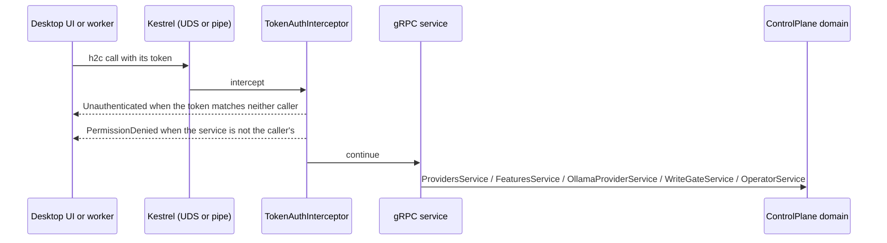

# Host.ControlPlane

> The local door the desktop app and the worker knock on: gRPC over a user-only socket, each with its own token that opens only its own rooms.

## To change here, read

- [[pages/invariants/no-executive-writes]]
- [[pages/decisions/0032-per-feature-write-permissions]]
- [[pages/decisions/0033-channel-operator-architecture]]
- [[pages/invariants/secrets-never-in-source]]
- [[pages/services/control-plane]]
- [[pages/services/control-plane-contracts]]
- [[pages/conventions/testing]]

## Responsibility

Owns the transport, authentication and gRPC adapters over [[pages/services/control-plane]]. Does not listen on TCP and does not run the chat loop ([[pages/services/host-console]]).

## Public contract

- **Entry points:** `AddControlPlaneHost` (`src/Scout.Host.ControlPlane/ControlPlaneServiceRegistration.cs:20`) and `MapControlPlaneServices` (`:46`); process entry `src/Scout.Host.ControlPlane/Program.cs:9`.
- **gRPC services:** `ProvidersGrpcService` (`src/Scout.Host.ControlPlane/Services/ProvidersGrpcService.cs:14`), `ModelsGrpcService` (`src/Scout.Host.ControlPlane/Services/ModelsGrpcService.cs:13`), `FeaturesGrpcService` (`src/Scout.Host.ControlPlane/Services/FeaturesGrpcService.cs:16`) over `FeaturesService`, `IActionQueue` and `IWriteLog`, `WorkerGateGrpcService` (`src/Scout.Host.ControlPlane/Services/WorkerGateGrpcService.cs:15`) over `WriteGateService` and the worker side of `OperatorService`, and `OperatorGrpcService` (`src/Scout.Host.ControlPlane/Services/OperatorGrpcService.cs:15`) over the desktop side of `OperatorService`, mapped at `src/Scout.Host.ControlPlane/ControlPlaneServiceRegistration.cs:56` and `:58`; mapping helpers `FeatureMapping` (`src/Scout.Host.ControlPlane/Services/FeatureMapping.cs:16`), `OperatorMapping` (`src/Scout.Host.ControlPlane/Services/OperatorMapping.cs:34`) and `ProviderMapping`.
- **Write grants, queue and log over gRPC** ([[pages/decisions/0032-per-feature-write-permissions]]): `Enable` passes `confirm_writes` (`src/Scout.Host.ControlPlane/Services/FeaturesGrpcService.cs:83`); `SetWriteGrant` (`:92`); `ListPendingActions`, `ApproveAction`, `RejectAction` and `ListWrites` (`:100`, `:113`, `:122`, `:131`), where a `limit` of 0 or less means 50 (`:18`); approve and reject both hand the request's optional `reason` to the queue, and the returned action carries it (`tests/Scout.ControlPlane.Tests/Integration/FeatureWritesGrpcTests.cs:146`). `WriteConfirmationRequiredException` answers `FAILED_PRECONDITION` with "Confirm the writes of <id> before enabling it: " or "... before granting them: " followed by each write row as `<scope> (write)` or `<scope> (irreversible write)` (`:162`); an unknown action answers `NOT_FOUND` and an already decided one `FAILED_PRECONDITION` (`:166`, `:170`). The mapping writes `access` and `write_class` as the enum ordinals and every time as ISO 8601 round-trip text (`src/Scout.Host.ControlPlane/Services/FeatureMapping.cs:31`, `:64`, `:77`, `:107`); a queued action's `status` is `pending`, `approved`, `rejected` or `executed` (`src/Scout.Host.ControlPlane/Services/FeatureMapping.cs:87`, `tests/Scout.ControlPlane.Tests/Integration/FeatureWritesGrpcTests.cs:162`), and its `reason` is set only when the owner gave one (`src/Scout.Host.ControlPlane/Services/FeatureMapping.cs:102`). The token interceptor is registered for the whole gRPC service set, so these calls need the desktop token like the others.
- **Worker gate over gRPC:** `RequestWrite` (`src/Scout.Host.ControlPlane/Services/WorkerGateGrpcService.cs:26`) answers the decision as the lowercase `allowed`, `queued` or `refused`, the reason, and the action id only when queued; `RecordWrite` (`:50`) answers `FAILED_PRECONDITION` with the gate's message when the write could not have been permitted (`:67`). The semantics are on [[pages/services/control-plane]].
- **Operator over gRPC** ([[pages/decisions/0033-channel-operator-architecture]]): the desktop's `GetMandate`, `SaveMandate`, `ListProjects`, `GetProject`, `StartProject` and `DecideClaim` (`src/Scout.Host.ControlPlane/Services/OperatorGrpcService.cs:24`, `:28`, `:33`, `:43`, `:47`, `:51`), and `ProduceProject`, `ReorderScenes`, `SetSceneLocked`, `RegenerateScene`, `AttachSceneMedia`, `GetMediaDirectory` and `GetReadiness` (`:61`, `:65`, `:70`, `:75`, `:80`, `:90`, `:96`), and `AssembleProject`, `ConfirmMediaRights`, `EditPackageMetadata` and `ApprovePackage` (`:100`, `:104`, `:108`, `:118`); the worker's `GetOperatorMandate`, `SaveOperatorProject`, `NextQueuedProject`, `GetOperatorProject`, `ListOperatorProjects`, `GetOperatorMediaDirectory` and `ReportReadiness` on `WorkerGate` (`src/Scout.Host.ControlPlane/Services/WorkerGateGrpcService.cs:73`, `:77`, `:85`, `:103`, `:107`, `:117`, `:123`); the two reads map the project as the desktop sees it, claims and their owner decisions included. `OperatorMapping` writes statuses, origins and claim statuses as the stored strings and every time as ISO 8601 round-trip text, sets the optional `updated_at`, `script`, `error` and `note` only when present, and never puts a project's origin reference in a `Project`; only `NextQueuedProjectResponse.origin_reference` carries it, to the worker (`src/Scout.Host.ControlPlane/Services/OperatorMapping.cs:68`). Scenes map field for field, `error`, `audio_file` and `visual_file` set only when present; the `package` is set only when the project has one and maps field for field, its Shorts, checks and tags in order, `video_file`, `thumbnail_file`, `approved_at` and `error` set only when present (`src/Scout.Host.ControlPlane/Services/OperatorMapping.cs:260`, `:299`); a `package` the worker sends with an `approved_at` that is not ISO 8601 round-trip text is `INVALID_ARGUMENT` "'<value>' is not a time Scout accepts." (`:314`), and any other `approved_at` is refused by the service as the owner's; `Readiness` maps both ways, and the worker's own `reported_at` is dropped on the way in so the control plane's time replaces it. A `SaveOperatorProject` without a project saves an empty one, which the service refuses. `OperatorMapping.Guard` (`:162`) answers `OperatorValidationException` as `INVALID_ARGUMENT`, `OperatorNotFoundException` as `NOT_FOUND`, `OperatorWriteRefusedException` as `PERMISSION_DENIED` with the gate's reason, `OperatorTamperingException` as `FAILED_PRECONDITION`, and `OperatorStoreException`, a readiness report that cannot be written, as `FAILED_PRECONDITION` with its sentence (`src/Scout.Host.ControlPlane/Services/OperatorMapping.cs:184`, `tests/Scout.ControlPlane.Tests/Integration/OperatorGrpcTests.cs:363`) (`src/Scout.Host.ControlPlane/Services/OperatorMapping.cs:170`, `:174`, `:178`, `:182`); a grant refusal and an interceptor denial share the `PERMISSION_DENIED` code and differ in their text. The desktop's `StartProject` is one of the grant refusals: without the owner's YouTube write grant it answers `PERMISSION_DENIED` with "The owner has not allowed youtube to write; allow it on the Features screen of Scout Desktop."
- **Security:** two callers. The desktop's `SessionToken` (`src/Scout.Host.ControlPlane/Security/SessionToken.cs:11`) is read from the environment or minted at startup; the worker's token is read from the environment only. `CallerTokens.Create` (`src/Scout.Host.ControlPlane/Security/CallerTokens.cs:34`) pairs them: a missing or blank worker token leaves the worker role empty and logs one warning, "SCOUT_CONTROLPLANE_WORKER_TOKEN is not set; the WorkerGate service refuses every caller, so the worker cannot request a write." (`:41`), and a worker token equal to the desktop token throws, without naming either value (`:49`). `Program` resolves the pair before Kestrel binds, so equal tokens refuse to start and the warning is logged once at startup (`src/Scout.Host.ControlPlane/Program.cs:31`). `TokenAuthInterceptor` (`src/Scout.Host.ControlPlane/Security/TokenAuthInterceptor.cs:17`) accepts a token in an `authorization` bearer header or `x-scout-token`, compares it in constant time against the desktop token and then the worker token (`src/Scout.Host.ControlPlane/Security/SessionToken.cs:62`), and answers `UNAUTHENTICATED` when it matches neither (`src/Scout.Host.ControlPlane/Security/TokenAuthInterceptor.cs:93`). Then it allows only the role's services, by the method's `/<package>.<Service>/` prefix taken from the generated service descriptors (`:105`): the desktop token reaches `Features`, `Providers`, `Models` and `Operator` (`:23`), the worker token reaches `WorkerGate` (`:31`), and everything else, including a method of a service added later, answers `PERMISSION_DENIED` "This caller may not call <method>." (`:100`). Neither token is ever logged or put in an exception message.
- **Configuration and environment:** `Scout:ControlPlane:SocketPath` (`src/Scout.Host.ControlPlane/Program.cs:24`); environment variables `SCOUT_CONTROLPLANE_TOKEN` (`src/Scout.Host.ControlPlane/Security/SessionToken.cs:14`) and `SCOUT_CONTROLPLANE_WORKER_TOKEN` (`src/Scout.Host.ControlPlane/Security/CallerTokens.cs:15`), both scrubbed from the Ollama daemon's environment ([[pages/services/control-plane]]); `XDG_RUNTIME_DIR` for the socket directory (`src/Scout.Host.ControlPlane/Transport/ControlPlaneEndpoint.cs:28`); the domain keys listed on [[pages/services/control-plane]].
- **External boundaries:** Unix domain socket `controlplane.sock` on Linux and macOS, named pipe `scout-controlplane` on Windows (`src/Scout.Host.ControlPlane/Transport/ControlPlaneEndpoint.cs:12,15`); filesystem permissions on the socket and its directory (`:41`, `:95`).

## How it works

```mermaid
sequenceDiagram
    participant UI as Desktop UI or worker
    participant K as Kestrel (UDS or pipe)
    participant I as TokenAuthInterceptor
    participant S as gRPC service
    participant D as ControlPlane domain
    UI->>K: h2c call with its token
    K->>I: intercept
    I-->>UI: Unauthenticated when the token matches neither caller
    I-->>UI: PermissionDenied when the service is not the caller's
    I->>S: continue
    S->>D: ProvidersService / FeaturesService / OllamaProviderService / WriteGateService / OperatorService
```

Startup refuses to run on Unix when the native `stat` self-test fails, because the socket anti-hijack pre-flight depends on it (`src/Scout.Host.ControlPlane/Program.cs:36`). After Kestrel binds, the socket mode is tightened to owner read and write (`src/Scout.Host.ControlPlane/Program.cs:59`, `src/Scout.Host.ControlPlane/Transport/ControlPlaneEndpoint.cs:100`). On Windows the pipe is restricted to the current user (`src/Scout.Host.ControlPlane/Program.cs:16`).

## Invariants

- [[pages/invariants/no-executive-writes]]: `PullModel` and `DeleteModel` (`src/Scout.Host.ControlPlane/Services/ModelsGrpcService.cs:22,59`) and the start and stop calls are reachable by any holder of the desktop token, never by the worker's.
- [[pages/decisions/0032-per-feature-write-permissions]]: granting a write and approving an action happen only through this host with the desktop token (`tests/Scout.ControlPlane.Tests/Integration/FeatureWritesGrpcTests.cs:172`). The worker can request but never approve: its token gets `PERMISSION_DENIED` on `ApproveAction`, `RejectAction`, `SetWriteGrant`, `Enable`, `Disable`, `DeleteCredentials`, `ListFeatures`, `StartProvider` and `DeleteModel`, and the action stays pending and the feature ungranted (`tests/Scout.ControlPlane.Tests/Integration/WorkerGateGrpcTests.cs:26`); the desktop token gets `PERMISSION_DENIED` on `RequestWrite` and `RecordWrite` (`:63`); no or a wrong token stays `UNAUTHENTICATED` on the gate (`:140`); a host started without a worker token keeps the gate closed and still serves the desktop (`:156`). The role table is pinned per method at `tests/Scout.ControlPlane.Tests/Security/TokenAuthInterceptorTests.cs:60`.
- [[pages/decisions/0033-channel-operator-architecture]]: the `Operator` service belongs to the desktop alone and the seven operator methods of `WorkerGate` to the worker alone (`tests/Scout.ControlPlane.Tests/Security/TokenAuthInterceptorTests.cs:179`, `:196`), the four package methods included (`:210`). Over the socket the worker token gets `PERMISSION_DENIED` on all seventeen `Operator` methods and the mandate and projects stay as they were (`tests/Scout.ControlPlane.Tests/Integration/OperatorGrpcTests.cs:47`, `:444`), and the desktop token on `GetOperatorMandate`, `SaveOperatorProject`, `NextQueuedProject`, `GetOperatorMediaDirectory` and `ReportReadiness`, which then stores nothing (`:83`). The mandate the desktop saves is the one the worker reads (`:114`); the desktop's start is refused without the grant and lists nothing, and a project the desktop starts is taken by the worker only under the grant, saved as `script_ready` with its claims, shown to the desktop, and decided by the owner, whose decision the worker cannot overwrite (`:137`); a chat project's origin reference reaches the worker and never the desktop (`:183`); the desktop token gets `PERMISSION_DENIED` on `GetOperatorProject` and `ListOperatorProjects` (`:230`); the worker reads a project only under the grant, sees the owner's claim decisions, lists newest first within its limit without the origin reference, and each of its saves and each project it takes shows in `ListWrites` (`:245`). Production over the socket (`:284`): `ProduceProject` with a claim pending is `INVALID_ARGUMENT` "1 claim is still pending; decide it before production.", and once the claim is decided it queues the project, which the worker takes as `producing`; the worker and the desktop get the same media directory; the scenes the worker saves come back to the desktop field for field, optional fields unset when absent; reorder, attach, lock and regenerate answer the edited project, regenerating a locked scene is `INVALID_ARGUMENT`, an unknown scene `NOT_FOUND`, `../x.mp3` and the media directory of `../x` `INVALID_ARGUMENT`, and a worker save that changes a locked scene `FAILED_PRECONDITION`. The readiness the worker reports is the one the desktop reads, with the control plane's `reported_at` in place of the worker's, and before any report the desktop reads the empty one with its note (`:382`). Scenes cross the mapping and back unchanged, optional fields unset when absent (`:405`), and readiness keeps the control plane's stamp on the way out and drops the sender's on the way in (`:426`). Assembly over the socket (`:471`): `AssembleProject` queues a media-ready project with an empty package, the worker takes it as `assembling` with its package `assembling`, a worker package that confirms the rights is `FAILED_PRECONDITION` "Only the owner confirms the media rights of project '<id>'.", one with a 101-character title `INVALID_ARGUMENT` "The title is 1 to 100 characters.", one with `approved_at` "yesterday" is `INVALID_ARGUMENT`, the reported package comes back field for field, `ApprovePackage` before the rights is `INVALID_ARGUMENT` "Confirm the media rights first.", `EditPackageMetadata` trims the title and refuses one of 101 characters, and after `ConfirmMediaRights` the approval answers `approved` with `approved_at` and shows in `ListWrites` as `approved package` by `owner`. A package crosses the mapping and back unchanged, optional fields unset when absent, and a project without one has no `package` (`:539`).
- [[pages/invariants/secrets-never-in-source]]: both tokens are minted by the desktop or read from the environment, never from a file in the repository, and never logged (`tests/Scout.ControlPlane.Tests/Security/CallerTokensTests.cs:14`, `:45`).

## Hot spots

- `src/Scout.Host.ControlPlane/Transport/NativeUnix.cs:15`: native `stat` interop for socket ownership checks.
- `src/Scout.Host.ControlPlane/Transport/ControlPlaneEndpoint.cs:54`: pre-flight on an existing socket path.
- `src/Scout.Host.ControlPlane/Security/TokenAuthInterceptor.cs:40`: the interceptor covers unary and streaming handlers; a new RPC kind must be added here, and a new service is denied to both callers until it joins a role list (`:23`, `:31`).

## Testing footprint

Covered by `tests/Scout.ControlPlane.Tests` (267 test attributes in total, 27 files): `Security/SessionTokenTests.cs`, `Security/TokenAuthInterceptorTests.cs` (the role table per method), `Security/CallerTokensTests.cs` (equal tokens, a missing worker token and its one warning), and `Integration/` tests that start the host on a Unix socket (`ControlPlaneUdsIntegrationTests.cs`), check the gRPC boundary (`ControlPlaneBoundaryTests.cs`), and drive the write confirmation, `SetWriteGrant`, the queue and the log over the socket (`FeatureWritesGrpcTests.cs`) the two callers of the worker gate (`WorkerGateGrpcTests.cs`) and of the operator (`OperatorGrpcTests.cs`; the test host pins a desktop token and, unless a test asks otherwise, a worker token, opens a channel with either, and exposes its services so a test can seed the queue and the log). The `Transport/` test folder is empty.

## Consumers

Two clients, each with its own token. The desktop main process starts the host when the app starts and stops it on quit; the Features and Review screens call the `Features` service through it. `Providers` is only exercised by tests, and nothing calls `Models` yet. The worker, `Scout.Host.Console`, calls `WorkerGate` only, with the socket path and the worker token the desktop passes it ([[pages/services/host-console]], [[pages/services/desktop-ui]]).

- **Lifecycle.** `connectControlPlane` (`ui/packages/main/src/control-plane/launcher.ts:231`), called from `ui/packages/main/src/main.ts:596`, launches the host, waits up to 10 s for the socket file (`ui/packages/main/src/control-plane/launcher.ts:190`) and opens the client. Every failure becomes `ControlPlaneUnavailableError`, and the Features screen then says the control plane is not running. A failure after the spawn, such as a socket that never appears, kills the host it launched. When the host exits mid-session the client is closed, so the next Features call fails at once as unavailable instead of waiting out its deadline; `dispose()` closes the client and kills the host. `workerGate()` (`ui/packages/main/src/control-plane/launcher.ts:268`) gives the socket path and the worker token from the moment the host is launched, before its socket exists, and `null` when the launch was unsupported or failed or the host exited (`:240`, `:252`); main passes it to every worker start (`ui/packages/main/src/main.ts:492`). There is no restart policy and no parent-death watchdog (`ui/packages/main/src/control-plane/launcher.ts:139`).
- **Launcher.** `launchControlPlane` (`ui/packages/main/src/control-plane/launcher.ts:106`) spawns the host and sets three environment variables on the child: `Scout__ControlPlane__SocketPath`, a per-process socket `controlplane-<pid>.sock` under `$XDG_RUNTIME_DIR/scout` or a per-uid `scout-<uid>` folder under the temp directory (`ui/packages/main/src/control-plane/launcher.ts:97`, `:144`), `SCOUT_CONTROLPLANE_TOKEN`, a fresh 64-hex-character token (`ui/packages/main/src/control-plane/launcher.ts:136`), and `SCOUT_CONTROLPLANE_WORKER_TOKEN`, a second token minted by a separate call of the same strength (`:137`, `:146`) and returned as `workerToken`. The desktop token travels only in the host's environment and in the desktop's call metadata; the worker token reaches the worker only as `SCOUT__WORKERGATE__TOKEN` ([[pages/services/desktop-ui]]); neither is set on the desktop's own `process.env`, and the launcher never logs either (`ui/packages/main/test/control-plane-launcher.test.ts:127`). Because the explicit socket path makes the host skip its own directory setup, the launcher secures the socket directory itself before it mints the token or spawns: it refuses a symbolic link, a non-directory or a directory owned by another uid, and tightens a directory open to group or others to `0700` (`ui/packages/main/src/control-plane/launcher.ts:75`). The child inherits the parent environment minus every variable that could move its listener or override its socket path or token (`ui/packages/main/src/control-plane/launcher.ts:67`): `SCOUT_CONTROLPLANE_TOKEN`, `SCOUT_CONTROLPLANE_WORKER_TOKEN` (`:47`), `Scout__ControlPlane__SocketPath`, `URLS`, `HTTP_PORTS`, `HTTPS_PORTS` and every `Kestrel__` key, matched in any casing, with `:` or `__`, and with or without the `ASPNETCORE_` or `DOTNET_` prefix. `extraEnv` applies next and the launcher's own socket path and two tokens last. Without that filter an inherited `Kestrel__Endpoints__Http__Url` made the real host listen on TCP beside the socket; `ui/packages/main/test/control-plane-integration.test.ts` checks that the port now refuses connections.
- **Binary.** `resolveControlPlaneBinary` (`ui/packages/main/src/worker/resolve-binary.ts:51`) honours `SCOUT_CONTROLPLANE_BIN`, then the packaged `worker/<rid>/` folder beside the console worker, then `src/Scout.Host.ControlPlane/bin/Release/net10.0/` and `bin/Debug/net10.0/` under the repository root. `ui/build/scripts/publish-worker.sh:14` publishes the host into that packaged folder.
- **Client.** `createControlPlaneClient` (`ui/packages/main/src/control-plane/client.ts:450`) dials `unix:<absolute path>` with `@grpc/grpc-js` and insecure channel credentials, waits for the channel before each call under the same deadline (`ui/packages/main/src/control-plane/client.ts:513`), and sends the token as `x-scout-token` metadata on every call (`ui/packages/main/src/control-plane/client.ts:515`). It maps `UNAVAILABLE`, `DEADLINE_EXCEEDED` and a channel that never becomes ready to `ControlPlaneUnavailableError`, `UNAUTHENTICATED` to `ControlPlaneUnauthenticatedError`, and `UNIMPLEMENTED` to `ControlPlaneNotImplementedError` (`ui/packages/main/src/control-plane/client.ts:260`); other codes pass through as the raw gRPC error. It loads `providers.proto` and `features.proto` with `@grpc/proto-loader` at runtime (camelCase field names, enums as strings), from `resources/protos` when packaged (`ui/build/electron-builder.yml:42`). It maps `Feature` messages onto the renderer's `FeatureDto` (`ui/packages/main/src/control-plane/client.ts:291`): an unset optional string becomes `null`, `has_scope_matrix` and `has_setup_steps` decide between a list and `null`, and an `UNSPECIFIED` status becomes `error`. `setupFeature` splits the renderer's settings into upserts and `cleared_settings` for the keys set to `null` (`ui/packages/main/src/control-plane/client.ts:571`).
- **What the host does with Features today.** `ListFeatures` returns `github` then `kubernetes`. `SetCredentials` keeps the values in `InMemoryCredentialStore`, because no host registers a keyring store, and validates nothing, because no host registers a credential validator. `Enable` answers `UNIMPLEMENTED` because `NullFeatureActivator.CanActivate` is false (`src/Scout.ControlPlane/Features/IFeatureActivator.cs:31`, `src/Scout.ControlPlane/Features/FeaturesService.cs:268`); for a feature with write rows the missing `confirm_writes` answers `FAILED_PRECONDITION` first. `Disable`, `DeleteCredentials` and a `Setup` that carries settings write the feature state file, `Scout/features.json` under the user's local application data folder unless `Scout:Features:StateStore:FilePath` is set. Gaps in [[pages/roadmap/followups]].
- **Tests.** `ui/packages/main/test/control-plane-integration.test.ts` launches the real host binary with the feature state file in a temp folder and checks, among others: `ListProviders` returns `OLLAMA` then `LM_STUDIO`; a wrong token is rejected as `UNAUTHENTICATED`; the worker token the launcher handed the host gets `PERMISSION_DENIED` on `ListFeatures` and `SetWriteGrant` and leaves YouTube ungranted (`ui/packages/main/test/control-plane-integration.test.ts:173`); `ListFeatures` returns GitHub and Kubernetes; `SetCredentials` with a `pat` moves GitHub from `needs-credentials` to `disabled` while `Enable` fails with `ControlPlaneNotImplementedError`. It also checks that the state file lands in the temp folder and that the developer's own `features.json` is unchanged. `ui/packages/main/test/control-plane-client.test.ts` runs the Features client against an in-process grpc-js server on a temp socket. CI builds the host before the UI tests (`.github/workflows/ui-ci.yml:107`).
- **Windows.** The host listens on the named pipe `scout-controlplane` on Windows. The launcher returns `unsupported` on `win32` and spawns nothing (`ui/packages/main/src/control-plane/launcher.ts:118`), and the client refuses before creating a channel (`ui/packages/main/src/control-plane/client.ts:453`), so on Windows the Features screen says the control plane is not running. `@grpc/grpc-js` documents no named-pipe target. Its `unix:` resolver passes the path to Node's `net.connect`, which accepts `\\.\pipe\` names on Windows, so a pipe target may work, but nobody has run it on Windows. The choice between dialling the pipe through the `unix:` target, a named-pipe shim and a stdio fallback is pending.

## Related

Direct project references: [[pages/services/control-plane-contracts]], [[pages/services/control-plane]]. Map: [[pages/architecture/project-map]]. Consumer: the desktop launcher and client in the Consumers section above, phases 1 and 3 of [[pages/roadmap/control-plane-client]]; see [[pages/services/desktop-ui]].
